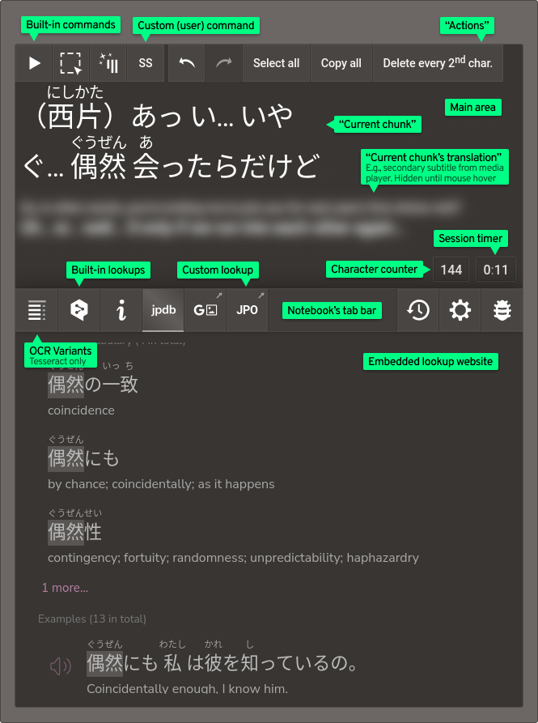

<!-- vim: set textwidth=80 colorcolumn=80: -->
<!-- markdownlint-configure-file
{
  "line-length": { "code_blocks": false },
  "no-inline-html": false
}
-->
# Kamite

> A desktop language immersion companion for learners of Japanese

*Note: This is alpha software.*

Kamite is a desktop program intended to aid learning Japanese through immersion
in native media (manga, anime, visual novels, etc.). It helps extract Japanese
text from those media into a local web interface, enabling its lookup using
pop-up dictionaries such as [Yomichan] and websites such as [DeepL
Translate][deepl] or [ichi.moe]. It offers integration with [mpv] and
[Textractor], among others. It lets you easily edit and transform the extracted
text and can forward it to user-defined websites and external executables.

Kamite is cost-free and licensed under the GNU AGPL v3 or later (see
[License](#license)).

**Currently supported platforms: Linux (Xorg, wlroots, GNOME Wayland\*, Plasma
Wayland\*), Windows.**\
(Planned for the beta release: macOS).\
\* OCR-ing arbitrary screen areas not supported on GNOME and Plasma on Wayland.

<!-- markdownlint-capture --><!-- markdownlint-disable -->
https://user-images.githubusercontent.com/4130634/178029301-075cb207-a154-42d2-adb5-ce8fdbcd722f.mp4
<!-- markdownlint-restore -->

Featured in the above demo video:

* (All shots) Firefox, [Sway].

* (Shot 1) [Gomics-v] manga reader (*Kaguya-sama wa Kokurasetai*, ch. 140);
[Yomichan] (dictionaries: *JMDict*, *Kanjium Pitch Accents*, *Narou
Freq*, *VN Freq*).

* (Shot 2) [mpv] (*Suzumiya Haruhi no Yuuutsu (2006)*, ep. 9).

* (Shot 3) *Summer Pockets*; [Textractor]; [`contrib/kamite-toggle-visibility.sh`](contrib/kamite-toggle-visibility.sh)
script; [waycorner][waycorner-icxes].

[deepl]: https://deepl.com/
[ichi.moe]: https://ichi.moe/
[mpv]: https://mpv.io/
[Textractor]: https://github.com/Artikash/Textractor

## Table of contents

1. [Installing Kamite](#installing-kamite)
    * [Linux](#linux)
        * [Arch User Repository](#arch-user-repository)
        * [Generic](#generic)
    * [Windows](#windows)
2. [Launching Kamite](#launching-kamite)
3. [User interface overview](#user-interface-overview)
4. [Text extraction](#text-extraction)
    * [Anime (and other video) text extraction](#anime-and-other-video-text-extraction)
        * [Mining anime](#mining-anime)
        * [Tip: auto-pausing at the end of subtitle](#tip-auto-pausing-at-the-end-of-subtitle)
        * [Alternatives for anime](#alternatives-for-anime)
    * [Manga text extraction](#manga-text-extraction)
        * [Setting up “Manga OCR” Online](#setting-up-manga-ocr-online)
        * [Setting up “Manga OCR” (Local)](#setting-up-manga-ocr-local)
        * [Setting up OCR.space](#setting-up-ocrspace)
        * [Setting up Tesseract OCR](#setting-up-tesseract-ocr)
        * [Setting up extra OCR dependencies](#setting-up-extra-ocr-dependencies)
        * [OCR usage](#ocr-usage)
        * [OCR directory watcher](#ocr-directory-watcher)
        * [Recommended Linux manga viewer](#recommended-linux-manga-viewer)
        * [Mining manga](#mining-manga)
        * [Tip: quickly trigger OCR with mouse hot corners](#tip-quickly-trigger-ocr-with-mouse-hot-corners)
        * [Alternatives for manga](#alternatives-for-manga)
    * [Visual novel / game text extraction](#visual-novel--game-text-extraction)
        * [Changing the default Textractor extension endpoint](#changing-the-default-textractor-extension-endpoint)
        * [Alternatives for games](#alternatives-for-games)
    * [Clipboard](#clipboard)
    * [Custom source / alternative method text extraction](#custom-source--alternative-method-text-extraction)
5. [Text use](#text-use)
    * [Editing and transforming the text](#editing-and-transforming-the-text)
    * [Pop-up dictionary](#pop-up-dictionary)
    * [Lookups](#lookups)
        * [Custom lookups](#custom-lookups)
6. [Custom commands (Launching external executables)](#custom-commands-launching-external-executables)
7. [Keyboard shortcuts](#keyboard-shortcuts)
    * [Client-only keyboard shortcuts](#client-only-keyboard-shortcuts)
        * [Chunk edit mode keyboard shortcuts](#chunk-edit-mode-keyboard-shortcuts)
        * [Media player keyboard shortcuts (client)](#media-player-keyboard-shortcuts-client)
    * [Global keyboard shortcuts](#global-keyboard-shortcuts)
        * [Linux/Xorg and Windows](#linuxxorg-and-windows)
        * [Linux/wlroots](#linuxwlroots)
8. [Launch options](#launch-options)
9. [Config](#config)
    * [Config profiles](#config-profiles)
10. [Style customization](#style-customization)
11. [Command API](#command-api)
    * [Sending commands](#sending-commands)
        * [DBus (Linux)](#dbus-linux)
        * [HTTP](#http)
    * [Command listing](#command-listing)
        * [`ocr_` commands](#ocr_-commands)
        * [`player_` commands](#player_-commands)
        * [`character-counter_` commands](#character-counter_-commands)
        * [`session-timer_` commands](#session-timer_-commands)
        * [`chunk_` commands](#chunk_-commands)
12. [Privacy](#privacy)
13. [Development](#development)
14. [License](#license)
    * [Third-party components](#third-party-components)

## Installing Kamite

### Linux

#### Arch User Repository

An AUR package is available under the name [kamite-bin] (installs to
`/opt/kamite`).

[kamite-bin]: https://aur.archlinux.org/packages/kamite-bin

#### Generic

Download the latest release package from the [Releases] page and extract it
to the location where you want to keep the program files. You can now launch
Kamite with the `bin/kamite` executable inside the extracted directory.

An optional `install.sh` script is provided in the release package that can
create a link to `bin/kamite` in the `/usr/bin/` directory, as well as install a
Desktop entry and program icons for application launchers. The files created by
the installation script can be removed by running:

```sh
install.sh --uninstall
```

To update, remove the old `kamite` directory and extract the new release package
in its place.

### Windows

Download the latest release package from the [Releases] page and extract it
to the location where you want to keep the program files. You can now launch
Kamite using `Kamite.exe` inside the extracted directory.

[Releases]: https://github.com/fauu/Kamite/releases

## Launching Kamite

Kamite can be launched:

* <ins>Linux</ins>: either using the `bin/kamite` executable directly or a using
  desktop launcher;

* <ins>Windows</ins>: either using the `Kamite.exe` executable or using the
  `Kamite.ps1` PowerShell script (the latter provides console output).

> Note (Windows): The execution of PowerShell scripts is disabled by default. To
> enable it, start PowerShell with the Run as Administrator option and execute
> the command `Set-ExecutionPolicy RemoteSigned`. Be aware that this lowers
> system security.

Besides the [config file](#config), Kamite supports configuration through
launch options. See [Launch options](#launch-options).

Kamite’s main user interface is a webpage served by a local server that should
be opened in your web browser. The default address is <http://localhost:4110>.

**The web client is only guaranteed to work without issues on the most recent
versions of Firefox and Chrome**.

Upon launch, Kamite will, by default: 1) navigate to the above address in the
default web browser, 2) open an auxiliary “Control” window, which lets you
monitor the program’s status as well as exit it. Both those behaviours can be
disabled by setting the [config keys](#config) `launchBrowser` and
`controlWindow`, respectively,  to `false`. Disabling the latter is useful when
Kamite is run from the command line, making the control window redundant.

Multiple config profiles can be prepared for Kamite and chosen between at the
time of its launch. See [Config profiles](#config-profiles).

## User interface overview

<p align="center">
  
</p>

Below are some non-obvious tips regarding the interface that might come useful.

* Double-clicking on the *current chunk* activates the chunk edit mode. To exit
  it, either click away or press <kbd>Ctrl</kbd> + <kbd>Enter</kbd>.

* The *notebook* can be temporarily resized by dragging its edge with the mouse
  (in order for the setting to persist, however, it must be set in the [config
  file](#config)).

* When the *action palette* does not fit the screen entirely, it can be scrolled
  with the mouse wheel.

* You can have incoming text chunk inserted into the current chunk instead of
  entirely replacing it. To do that, enter the chunk edit mode as described
  above and either: 1) place the caret where you want the incoming chunk to be
  inserted or 2) select the part of the current chunk that you wish replaced
  with it.

* The *character counter* and the *session timer* can be frozen/paused and
  restarted by, respectively, short-clicking and long-clickng on them.

## Text extraction

The first task when using Kamite is to get text from the immersion material into
the program. In Kamite’s terminology, a single incoming piece of text is called
a **chunk**.

The method of getting text chunks into Kamite will depend on the kind of the
source material:

### Anime (and other video) text extraction

Extracting text chunks from video is by default supported through integration
with the **[mpv]** video player. *Primary* video subtitles from mpv are treated
by Kamite as incoming chunks. If *secondary* subtitles are present, they are
treated as **chunk translations**.

To enable the connection between Kamite and mpv, the latter must be launched
with the following exact value for the `input-ipc-server` parameter:

<ins>Linux</ins>:

```sh
mpv file.mkv --input-ipc-server=/tmp/kamite-mpvsocket
```

<ins>Windows</ins> (PowerShell):

```powershell
C:\Program` Files\mpv\mpv file.mkv --input-ipc-server=\\.\pipe\kamite-mpvsocket
```

<br>

Alternatively, the line

```sh
input-ipc-server=<above_path>
```

can be put into the [mpv config file][mpv-ref-config].

In the former case, mpv will only be open for communication with Kamite when
launched with the specified parameter. In the latter—it will be open always.

> For more on the communication mechanism used, see the
[mpv reference for JSON IPC][mpv-ref-json-ipc].

To run mpv with an external subtitle file, use the `--sub-file` launch
parameter (it can be repeated for multiple subtitle files). To assign a given
subtitle track as *primary* (assumed by Kamite to be the Japanese subtitles) and
*secondary* (assumed to be the translations), respectively, use the `--sid` and
`--secondary-sid` mpv launch parameters. Which subtitle IDs to specify can be
glanced by pressing <kbd>F9</kbd> in mpv while the video file is opened and the
subtitles loaded.

Note: Subtitles hidden within mpv will still be recognized by Kamite.

**Note: The subtitle extraction functionality will not work with subtitles that
are stored as images, not as text.**

> See also: [mpv reference: Subtitle options][mpv-ref-sub-options].

Below are excerpts from example scripts used to quickly launch an anime episode
in mpv in such a way that it is immediately set up to work with Kamite.

<ins>Linux</ins>:

<!-- markdownlint-capture --><!-- markdownlint-disable -->
```sh
mpv "/path/to/video/"*"Some Anime Name"*"E$1"*".mkv" \ # Episode no. passed as an argument to the script
  --input-ipc-server=/tmp/kamite-mpvsocket \
  --sub-file="/path/to/external/subtitles/$1.jp.srt" \
  --sid=2 \ # ID of the Japanese subtitles provided externally
  --secondary-sid=1 \ # ID of the English subtitles embedded in the video file (to be used as translations)
  --secondary-sub-visibility=no \
  --save-position-on-quit \
  --profile=jpsub # An optional custom profile that can set a special subtitle font and size, etc. It must be defined separately in the mpv config file: see https://mpv.io/manual/stable/#profiles
```
<!-- markdownlint-restore -->

<ins>Windows</ins> (PowerShell):

```powershell
# See the Linux example above for more information
param ([String] $ep) # $ep will be replaced with the first parameter to the
                     # script (here assumed to be the episode number)
C:\Program` Files\mpv\mpv "\path\to\video\*Some Anime Name*E$ep.mkv" `
  --input-ipc-server=\\.\pipe\kamite-mpvsocket `
  --sub-file="\path\to\external\subtitles\$ep.jp.srt" `
  --sid=2 `
  --secondary-sid=1 `
  --secondary-sub-visibility=no `
  --save-position-on-quit `
  --profile=jpsub
```

Kamite can be useful even when viewing media without Japanese subtitles, for
example as an area where heard words and phrases can be typed in and looked up.

When viewing media with translated subtitles only, Kamite can be instructed to
treat them as translations for unknown chunks and display them as such, by
enabling “Translation-only mode” in the Settings tab or by launching with the
config key `chunk.translationOnlyMode` set to `true`.

[mpv-ref-config]: https://mpv.io/manual/stable/#configuration-files
[mpv-ref-json-ipc]: https://mpv.io/manual/stable/#json-ipc
[mpv-ref-sub-options]: https://mpv.io/manual/stable/#subtitles

#### Mining anime

Kamite works well with [Anacreon’s mpv script][anacreon-mpv] used for
automatically enhancing [Anki] cards with video-derived content. After creating
a card, with the script installed, simply press <kbd>Ctrl</kbd> + <kbd>C</kbd>
in the Kamite tab, followed by <kbd>Ctrl</kbd> + <kbd>V</kbd> in the mpv window.
If you want the card context to span not one but several chunks, select them in
Kamite’s history window before pressing <kbd>Ctrl</kbd> + <kbd>C</kbd>.

[Anki]: https://apps.ankiweb.net/

##### Troubleshooting “ERR: Line not found…”

Sometimes this error can be caused by a slight formatting correction that Kamite
can apply to incoming text. However, every time Kamite makes such modifications,
it also makes it possible to copy the original, unchanged text. In such cases,
this is available under the “Copy original” buttons in the main and the chunk
history action palettes or under the keyboard shortcut <kbd>Ctrl</kbd> +
<kbd>Alt</kbd> + <kbd>C</kbd>.

The corrections on the side of Kamite can also be disabled by setting the
[config](#config) key `chunk.correct` to `false`.

If the error persists, make sure you are copying the entire chunk, or, if there
are multiple of them, that they are consecutive in the video’s subtitles.

##### For Wayland users

Anacreon’s mpv script needs a slight modification to work on Wayland. In
function `get_clipboard()`, replace

```lua
res = utils.subprocess({ args = {
  'xclip', '-selection', 'clipboard', '-out'
} })
```

with

```lua
res = utils.subprocess({ args = { 'wl-paste' } })
```

This requires [wl-clipboard] to be installed.

[anacreon-mpv]: https://animecards.site/minefromanime/#anacreon-mpv-script
[wl-clipboard]: https://github.com/bugaevc/wl-clipboard

#### Tip: auto-pausing at the end of subtitle

This can be useful for beginners whose comprehension is not yet at the level
needed to follow even simple video content at the natural pace. The *sub-pause*
mpv script from [mpv-sub-scripts] can be used for this purpose. Once the script
is installed, press <kbd>N</kbd> inside mpv to enable auto-pausing.

Additional tips:

* You can pause/unpause in mpv with a right-click.
* With the *sub-pause* script, you can replay from the start of the last
  subtitle by pressing <kbd>Ctrl</kbd> + <kbd>R</kbd> in mpv.

[mpv-sub-scripts]: https://github.com/Ben-Kerman/mpv-sub-scripts

#### Alternatives for anime

<dl>
  <dt><a href="https://ripose-jp.github.io/Memento/">Memento</a></dt>
  <dd>An mpv-based video player that includes Yomichan-like dictionary lookup
  integrated right within the subtitle overlay as well as Anki support.</dd>
  <dt><a href="https://github.com/animebook/animebook.github.io">Animebook</a></dt>
  <dd>An in-browser video player which allows easy Yomichan lookups and Anki
  card enhancement.</dd>
  <dt><a href="https://github.com/killergerbah/asbplayer">asbplayer</a></dt>
  <dd>A browser-based media player for subtitle sentence mining. Supports
  various video streaming websites directly.</dd>
  <dt><a href="https://github.com/marisukukise/japReader">japReader</a></dt>
  <dd>A pop-up dictionary program that can track known words.</dd>
</dl>

### Manga text extraction

Kamite integrates with four alternative OCR (Optical Character Recognition)
providers to enable the extraction of text from manga pages displayed on screen.
The available OCR engines are:

* [“Manga OCR”][manga-ocr] Online ([a Hugging Face Space by Gryan
  Galario][manga-ocr-hf-gg])
* [“Manga OCR”][manga-ocr] (Local)
* [OCR.space] (Online)
* [Tesseract OCR][tesseract] (Local)

**“Manga OCR” in either variant is the recommended choice** as it gives superior
results for manga. The online version is extremely simple to set up, but
requires sending screenshots of portions of your screen to a third party. The
local version, on the other hand, requires a more involved setup and extra
system resources.

[manga-ocr]: https://github.com/kha-white/manga-ocr
[tesseract]: https://github.com/tesseract-ocr/tesseract

**By default, OCR is disabled.** The necessary setup steps are:

1. Set the [config](#config) key
`ocr.engine` to one of: `mangaocr_online`, `mangaocr`, `ocrspace`, or
`tesseract`.

1. Set up the selected engine:

    * [Setting up “Manga OCR” Online](#setting-up-manga-ocr-online)
    * [Setting up “Manga OCR”](#setting-up-manga-ocr)
    * [Setting up OCR.space](#setting-up-ocrspace)
    * [Setting up Tesseract OCR](#setting-up-tesseract-ocr)

1. (Linux/Xorg and wlroots platforms only)
[Set up extra OCR dependencies](#setting-up-extra-ocr-dependencies)

#### Setting up “Manga OCR” Online

> **Note:** The “Manga OCR” Online engine depends on a third-party online
service ([a Hugging Face Space by Gryan Galario][manga-ocr-hf-gg]), so using it
involves sending screenshots of portions of your screen to a third-party.
Here is [the stated privacy policy of Hugging Face][huggingface-privacy-policy].

The online API used by the “Manga OCR” Online engine is freely accessible and
consequently *does not* require any setup.

Remember to [set up extra OCR dependencies](#setting-up-extra-ocr-dependencies)
and to launch Kamite with the config key `ocr.engine` set to `mangaocr_online`.

[huggingface-privacy-policy]: https://huggingface.co/privacy

#### Setting up “Manga OCR” (Local)

**Note:** “Manga OCR” will use up to 2.5 GB of disk space. During launch, it
will use up to 1 GB of additional memory.

##### Recommended option: installation using pipx

1. Install [Python][installing-python] and [pip] (the Windows Python installer
   already includes pip)

1. Install [pipx]

    <ins>Windows</ins>:

    ```powershell
    C:\Users\<user>\AppData\Local\Programs\Python\Python310\python.exe -m pip
    install --user pipx
    ```

    The `python.exe` location will vary depending on the installer and the
    installation options.

1. Install [manga-ocr]

    <ins>Linux</ins>:

    ```sh
    pipx install manga-ocr
    ```

    <ins>Windows</ins>:

    ```powershell
    C:\Users\<user>\AppData\Local\Programs\Python\Python310\python.exe -m pipx
    install manga-ocr
    ```

Kamite will now be able to use “Manga OCR”. On the first launch of Kamite with
`ocr.engine` set to `mangaocr`, “Manga OCR” will take some time to download its
model (around 450 MB). If there are issues, try running the (<ins>Linux</ins>)
`manga_ocr`, (<ins>Windows</ins>)
`C:\Users\<user>\.local\pipx\venvs\manga-ocr\Scripts\manga_ocr.exe` executable
installed by pipx and examining its output.

###### Deinstallation

1. Run `pipx uninstall`

    <ins>Linux</ins>:

    ```sh
    pipx uninstall manga-ocr
    ```

    <ins>Windows</ins>:

    ```powershell
    C:\Users\<user>\AppData\Local\Programs\Python\Python310\python.exe -m pipx
    uninstall manga-ocr
    ```

1. Delete the ~450 MB leftover model file in
(<ins>Linux</ins>) `~/.cache/huggingface/transformers/`, (<ins>Windows</ins>)
`C:\Users\<user>\.cache\huggingface\transformers`.

###### Troubleshooting “pipx "Manga OCR" installation absent…”

If pipx did not install to the default path expected by Kamite, you will have to
specify the path manually in the [config file](#config):

```sh
ocr {
  mangaocr {
    # Linux default
    pythonPath = "/home/<user>/.local/pipx/venvs/manga-ocr/bin/python"
    # Windows default
    pythonPath = "C:\Users\<user>\.local\pipx\venvs\manga-ocr\Scripts\python.exe"
  }
}
```

**The above paths are the defaults, which you will need to modify** according to
the output you get from running

<ins>Linux</ins>:

```sh
pipx list
```

<ins>Windows</ins>:

```powershell
C:\Users\<user>\AppData\Local\Programs\Python\Python310\python.exe -m pipx
list
```

[installing-python]: https://realpython.com/installing-python/
[pip]: https://pip.pypa.io/en/stable/installation/
[pipx]: https://pypa.github.io/pipx/

##### Custom installation

If you install “Manga OCR” not through pipx, you will need to manually specify a
path to a Python main executable (or a wrapper for it) that runs within an
environment where the `manga_ocr` module is available. For example, if installed
globally and the system Python executable is on `PATH` under the name `python`,
then the appropriate configuration will be simply:

```sh
ocr {
  mangaocr {
    pythonPath = python
  }
}
```

**Deinstallation note**: There will be a ~450 MB leftover model file in
(<ins>Linux</ins>) `~/.cache/huggingface/transformers/`, (<ins>Windows</ins>)
`C:\Users\<user>\.cache\huggingface\transformers`.

#### Setting up OCR.space

> **Note:** OCR.space is an online service, so using it involves sending
screenshots of portions of your screen to a third-party. Here is [the stated
privacy policy of OCR.space][ocrspace-privacy-policy].

The usage of the [OCR.space] free API is limited. The limits are defined by the
provider as “Requests/month: 25000, Rate Limit: 500 calls/DAY”.

1. Register for a free API key

    Fill the form at <https://ocr.space/ocrapi/freekey>. You will need to
    provide your email address, to which the key will be sent.

1. Put the API key in Kamite’s [config file](#config):

    > **Note:** This is unsafe plain-text storage. Abort if you deem your key too
    sensitive for this kind of storage

    ```sh
    …
    secrets {
      ocrspace = THE KEY GOES HERE
    }
    …
    ```

Remember to launch Kamite with the config key `ocr.engine` set to `ocrspace`.

[ocrspace-privacy-policy]: https://ocr.space/privacypolicy

#### Setting up Tesseract OCR

1. Install Tesseract

    <ins>Linux</ins>: Tesseract is available in the default repositories of most
    distributions. For example, under `tesseract-ocr` on Ubuntu or under
    `tesseract` on Arch Linux.

    <ins>Windows</ins>: It is recommended to use [the installer provided by
    UB Mannheim][tesseract-ub-mannheim].

1. Install Tesseract models prepared and verified for use with Kamite

    Download
    [`tesseract_traineddata_jpn_Kamite.zip`](https://mega.nz/file/9SsQBYTT#SDUSPerJ3iDsgSf08FlOWlVgbu7UICC_Oc7vg4D_YdQ)
    and extract the `.traineddata` files from the archive *directly* into
    Tesseract’s `tessdata` directory:

    * <ins>Linux</ins>: usually `/usr/[local/]share/tessdata` or
    `/usr/share/tesseract-ocr/<VERSION>/tessdata`;

    * <ins>Windows</ins>: the default for the UB Mannheim installer is
      `C:\Program Files\Tesseract-OCR\tessdata`.

1. If Tesseract is not available on `PATH` under the executable name
   `tesseract` (which it will not on Windows), set the [config](#config) key
   `ocr.tesseract.path` to its executable’s path:

   <ins>Windows</ins> (UB Mannheim installer default):

   ```sh
   ocr {
     tesseract {
       path = "C:\\Program Files\\Tesseract-OCR\\tesseract.exe" # Note the double backslashes
     }
   }
   ```

Once the setup has been completed, you can launch Kamite with the config key
`ocr.engine` set to `tesseract`.

[tesseract-ub-mannheim]: https://github.com/UB-Mannheim/tesseract/wiki

#### Setting up extra OCR dependencies

On some platforms, external programs are needed for text recognition related
tasks. You need to install them on your own.

##### Linux/Xorg extra OCR dependencies

<dl>
  <dt><a href="https://github.com/naelstrof/slop">slop</a></dt>
  <dd>Used for selecting a screen region or point.</dd>
</dl>

##### Linux/wlroots extra OCR dependencies

<dl>
  <dt><a href="https://github.com/emersion/slurp">slurp</a></dt>
  <dd>Used for selecting a screen region or point.</dd>
  <dt><a href="https://sr.ht/~emersion/grim/">grim</a></dt>
  <dd>Used for taking screenshots for OCR.</dd>
  <dt><a href="https://git.sr.ht/%7Ebrocellous/wlrctl">wlrctl</a></dt>
  <dd>(Optional) Used to trigger a mouse click for OCR Auto Block Instant
  mode.</dd>
</dl>

#### OCR usage

Text recognition can be initiated by:

* Issuing an OCR command through:
  * clicking the corresponding button in the command
    palette,
  * pressing the configured [keyboard shortcut](#keyboard-shortcuts), or
  * [sending the command through the API](#command-api).
* Adding or modifying an image in a directory provided to the [OCR directory
  watcher](#ocr-directory-watcher).

> **NOTE: On Linux / GNOME Wayland and Plasma Wayland**, only the following of
> the above are available:
>
> * the [`ocr_image` command](#ocr_-commands) (including external software that
>   uses it, for example [Gomics-v]),
> * the [OCR directory watcher](#ocr-directory-watcher).

The OCR commands directly available to the user are the following:

##### Manual block OCR

<!-- markdownlint-capture --><!-- markdownlint-disable -->
  
<!-- markdownlint-restore -->

Select area around a block of text and Kamite will OCR the area as is.

For the `tesseract` engine, this command has separate vertical and horizontal
variants that must be chosen manually depending on the orientation of the text
block.

##### Auto block OCR


Select a point within a block of text; Kamite will try to infer the extent of
the block and then OCR the resulting area.

*This should be good enough for > 90% of typical manga text blocks, but the
block detection algorithm has a lot of room for improvement.*

**Note (Linux/Xorg):** On Xorg, the point selection mechanism cannot be
restricted to just a point, meaning that when the mouse is pressed and dragged,
a rectangle area will be selected instead of a point. If this happens, Kamite
will consider the center of this area as the selected point.

##### Region OCR


Define a screen area in the config file and Kamite will OCR it as is.

This is intended as an alternative for games that do not work well with
Textractor.

**Note:** The feature is experimental and might currently not be usable in many
use cases.

Below is an illustration of setting up a region in the [config file](#config).

```sh
ocr {
  regions = [
    ${REGIONS.exampleGameTextbox}
    ${REGIONS.anotherRegion}
  ]
}

REGIONS = [
  exampleGameTextbox {
    # (1 character) This symbol will appear on the region’s button
    symbol = "E"

    # This description will appear in the region’s button tooltip
    description = "OCR Example Game's textbox"

    # The screen coordinates of the region’s top-left corner
    x = 350
    y = 800

    # The screen dimensions of the region
    width = 1000
    height = 150

    # Whether to try to automatically narrow the region’s screenshot to just
    # text before OCR-ing it.
    # Note: The implementation of this function is currently very basic. It may
    #       prove unreliable in most cases.
    autoNarrow = false
  }
]
```

###### Obtaining region parameters

To obtain the desired region coordinates and dimensions, use Kamite’s Region
Helper mode: Launch Kamite from console with the launch option `--regionHelper`,
select the desired areas, and copy the resulting region specifications from the
console output.

> Note (Windows): To get console output on Windows, you must launch Kamite using
> the `Kamite.ps1` PowerShell script.

###### Region OCR quality

“Manga OCR” and OCR.space engines should be viable here in at least some cases.
However, they both work best when the screenshot they are provided with is
narrowed to just the text. And since the current auto-narrowing algorithm is not
very reliable, for now it might be best to create separate regions for each possible
line count of the target text box (i.e., first region encompassing just one line
of text, second region encompassing the first and the second line, and so on)
and choose between them on the fly.

See also: [Config](#config), [Visual novel / game text extraction](#visual-novel--game-text-extraction),
[Alternatives for games](#alternatives-for-games).

***

##### Using alternative OCR variants (Tesseract OCR only)

When using the Tesseract OCR engine, Kamite executes Tesseract multiple times
for each OCR request on modified versions of the input image. This is in order
to somewhat compensate for the inferior results Tesseract gives.

When all the resulting text variants are identical, they are simply merged and
presented as one. When there are differing alternative variants, however, the
one determined the most likely to be the most accurate is displayed normally as
the *current chunk*, whereas the remaining variants appear under a new *OCR
Variants* tab placed at the left edge of the notebook’s tab bar.

Through the OCR Variants view, you can replace the current chunk with one of the
other variants by clicking the Pick button next to the corresponding variant.
You can also make text selections within both the current chunk and the
variants, which, upon clicking the Pick button, will lead to a partial text
replacement.

The OCR Variants view highlights characters that are unique to its variant to
make it easier to identify potential replacements for a misrecognized character
in the current chunk.

#### OCR directory watcher

Kamite can watch a specified directory for new/modified images and perform text
recognition on them automatically. This is especially useful for platforms that
do not support global OCR commands (Linux / GNOME Wayland and Plasma Wayland).

To enable the directory watcher, specify the directory path in the [config
file](#config):

```sh
ocr {
  watchDir = "/full/path/to/the/directory" # Linux variant
  watchDir = "C:\\path\\to\\the\\directory" # Windows variant (note the double slashes)
}
```

This can be used in conjunction with a platform-specific screenshot tool, for
example [GNOME Screenshot] on GNOME Wayland and [Spectacle] on Plasma Wayland.

Note that Kamite treats the entire input image as a single text block.
Consequently, the provided images should be area screenshots containing just the
text block to be recognized—not the entire screen or application window.

[GNOME Screenshot]: https://en.wikipedia.org/wiki/GNOME_Screenshot
[Spectacle]: https://apps.kde.org/spectacle/

#### Recommended Linux manga viewer

[Gomics-v] is the recommended manga viewer for Linux, as it includes simple
Kamite integration:

* *Right-click* on a text block to automatically recognize it.

* *Right-hold-click* on the image area to initiate a manual block recognition.

The integration must be enabled in Gomics-v under `Preferences › Kamite`.

#### Mining manga

The [`contrib/anki-screenshot.sh`](contrib/anki-screenshot.sh) script
(Linux/wlroots and Xorg) is convenient for enhancing cards mined from manga
with Kamite. When executed, it uses an external program to take a screenshot of
a user-selected screen area, scales it down to a configured size, converts it to
the storage-efficient WebP format, and adds it to the latest Anki card.

The script takes an optional positional argument, which by default is put into
the latest card’s Sentence field. This can be used to automatically update the
card with text present in Kamite. Below is a [config](#config) excerpt
illustrating how to achieve this.

```sh
commands {
  custom = [
    ${CUSTOM_COMMANDS.ankiScreenshot}
  ]
}

CUSTOM_COMMANDS {
  ankiScreenshot {
    symbol = ASS
    name = Anki screenshot
    command = "/path/to/anki-screenshot.sh {effectiveText}"
  }
}
```

This configuration will add a button labeled “ASS” to the command palette
that will execute the Anki Screenshot script, supplying it with Kamite’s
`effectiveText` (see
[Custom commands](#custom-commands-launching-external-executables)) as the
positional argument.

See near the top of the script file for the list of required dependencies and
for the configuration options.

#### Tip: quickly trigger OCR with mouse hot corners

When not using a manga viewer with Kamite integration, a good alternative to
clicking buttons in Kamite or using keyboard shortcuts for issuing OCR commands
are hot corners, i.e. screen areas that, when entered with the mouse cursor,
launch a supplied executable. This executable can be a script that sends a
specified OCR command to Kamite.

Below is an example of such setup for Linux/wlroots users.

> Xorg users who do not have the hot corners feature as a part of their desktop
environment might use [cornora] instead.

1. Install and build [icxes waycorner fork][waycorner-icxes] (supports not only
screen corners but also edges)

    Requires [Rust]. Run:

    ```sh
    git clone "https://github.com/icxes/waycorner"
    cd waycorner
    cargo build --release
    ```

1. Create a script that issues the desired OCR command to Kamite, e.g.:

    ```sh
    #!/usr/bin/env bash
    dbus-send --type=method_call --dest=io.github.kamitejp /Receiver io.github.kamitejp.Receiver.command string:'ocr_auto-block'
    ```

1. Create a waycorner config file containing the corner definition

    `~/.config/waycorner/config.toml`

    ```toml
    [kamite_ocr_auto_block]
    command = ["/path/to/the/above/script.sh"]
    locations = ["bottom"]
    size_height = 50
    size_width = 1500
    timeout_ms = 30
    ```

    See also: [waycorner: Configuration][waycorner-config].

1. Verify

    Run:

    ```sh
    path/to/waycorner/target/release/waycorner --preview
    ```

    and check if the command is executed properly when entering the highlighted
    area with the mouse cursor. If so, the program can be used normally without
    the `--preview` parameter.

[cornora]: https://github.com/okitavera/cornora/
[waycorner-icxes]: https://github.com/icxes/waycorner
[Rust]: https://www.rust-lang.org/tools/install
[waycorner-config]: https://github.com/icxes/waycorner#configuration

#### Alternatives for manga

<dl>
  <dt><a href="https://github.com/kha-white/mokuro">mokuro</a></dt>
  <dd>Takes manga images and generates HTML files where detected text blocks
  are overlaid with selectable text as recognized by “Manga OCR”, allowing for
  direct lookup with pop-up dictionaries.</dd>
  <dt><a href="https://wonderwize.github.io/mangareader/">Mangareader</a></dt>
  <dd>An in-browser manga reader with built-in support for OCR-ing selected
  regions using an online API backed by “Manga OCR”. Can be used in tandem with
  Kamite with the help of the Clipboard Inserter browser extension.</dd>
  <dt><a href="https://github.com/bluaxees/Cloe">Cloe</a></dt>
  <dd>OCRs a screen selection to clipboard using “Manga OCR”.</dd>
  <dt><a href="https://github.com/bluaxees/Poricom">Poricom</a></dt>
  <dd>Manga reader with built-in “Manga OCR” and Tesseract support. Can
  also be used to capture text from external programs.</dd>
  <dt><a href="https://github.com/rampaa/JL">JL</a></dt>
  <dd>A pop-up dictionary program for Windows with a convenient translucent UI
  that can be displayed on top of other windows. For manga, needs a separate
  program that can OCR to clipboard.</dd>
  <dt><a href="https://github.com/marisukukise/japReader">japReader</a></dt>
  <dd>A pop-up dictionary program that can track known words. For manga, needs
  a separate OCR-to-clipboard program.</dd>
  <dt><a href="https://github.com/Ajatt-Tools/transformers_ocr">transformers_ocr</a></dt>
  <dd>A simple Linux/Xorg OCR-to-clipboard script using “Manga OCR”.</dd>
</dl>

### Visual novel / game text extraction

Kamite provides an extension for **[Textractor]** that sends lines of text
extracted by it from other programs to Kamite.

> For games that do not work with Textractor, the experimental
[Region recognition](#region-ocr) feature might prove an alternative.

To install the *Kamite Send* Textractor extension:

1. Copy `Kamite Send.xdll` from either the `extra/textractor/x86` (32-bit
   Textractor) or `extra/textractor/x64` (64-bit Textractor) within the release
   package to the main Textractor directory (the one containing
   `Textractor.exe`).

   > Note: If you installed Kamite from AUR, the files will be in `/opt/kamite`.

2. In Textractor, press the `Extensions` button, right-click in the extension
   list, choose `Add extension` and select the `Kamite Send.xdll` file copied
   earlier.

For Textractor’s text processing extensions (such as Remove Repeated Characters)
to be executed before sending the text to Kamite, position Kamite Send below
them on the extensions list.

#### Changing the default Textractor extension endpoint

By default, the extension expects Kamite to listen for commands at the address
`localhost:4110`. If it is running on a different address (e.g., because you
have Textractor in a virtual machine and Kamite on the host), the extension
needs to be configured correspondingly. To do so, create a `Kamite Send.txt`
file next to `Kamite Send.xdll` in the Textractor directory, containing Kamite’s
network address from the perspective of the machine running Textractor, e.g.:

```txt
host=192.0.0.10:4110
```

#### Alternatives for games

Kamite’s own [Region OCR](#region-ocr) is provided as an alternative to using
Textractor for games. Some other alternatives are:

<dl>
  <dt><a href="https://github.com/mathewthe2/Game2Text-Lightning">Game2Text-Lightning</a></dt>
  <dd>A Windows OCR-powered pop-up dictionary program for games and other
  desktop applications.</dd>
  <dt><a href="https://github.com/rampaa/JL">JL</a></dt>
  <dd>A pop-up dictionary program for Windows with a convenient translucent UI
  that can be displayed on top of the game window. Needs Textractor with Copy to
  Clipboard extension or an external OCR-to-clipboard program.</dd>
  <dt><a href="https://github.com/marisukukise/japReader">japReader</a></dt>
  <dd>A pop-up dictionary program that can track known words.</dd>
</dl>

### Clipboard

Text can be pasted from clipboard by pressing <kbd>Ctrl</kbd> + <kbd>V</kbd> in
Kamite’s browser tab.

The Kamite browser client can automatically pick up clipboard text with the
Clipboard Inserter browser extension ([Firefox][clipboard-inserter-ff],
[Chrome][clipboard-inserter-chrome]) (assumes default extension settings).

Clipboard can also be watched automatically without the Clipboard Inserter
extension, but with a clipboard watcher script that sends changed clipboard
content to Kamite:

* <ins>Linux</ins> (except GNOME Wayland):
[`contrib/kamite-watch-clipboard.sh`](contrib/kamite-watch-clipboard.sh).

* <ins>Windows</ins>:
[`contrib/Kamite-Watch-Clipboard.ps1`](contrib/Kamite-Watch-Clipboard.ps1) (run
with `Right click › Run with PowerShell`).

[clipboard-inserter-ff]: https://addons.mozilla.org/en-US/firefox/addon/clipboard-inserter/
[clipboard-inserter-chrome]: https://chrome.google.com/webstore/detail/clipboard-inserter/deahejllghicakhplliloeheabddjajm

### Custom source / alternative method text extraction

Custom sources and alternative extraction methods can be integrated using the
[Command API](#command-api).

## Text use

What can be done with the text once it has been collected into the program.

### Editing and transforming the text

Depending on the source and the extraction method, the text coming into the
program might contain mistakes or other features that need to be changed for it
to be usable further. Kamite offers various text editing and transformation
features that might be useful for that task.

The main chunk text can be selected character by character using the mouse and
transformed using actions that appear in the *action palette* near it, which are
made available depending on the existence and the content of the selection.
Characters can also be deleted by pressing <kbd>Delete</kbd> or
<kbd>Backspace</kbd>.

To enter chunk edit mode, which allows for direct insertion of typed text,
double-click the main area. To exit it, either click away from the input field
or press <kbd>Ctrl</kbd> + <kbd>Enter</kbd>.

### Pop-up dictionary

The basic task around which Kamite is designed is using a pop-up dictionary
browser extension to help you decipher the text you understand only partially.
The recommended such extension is **Yomichan**, which, as can be read on its
website, “stands apart in its goal of being an all-encompassing learning tool as
opposed to a mere browser-based dictionary”.

[Yomichan’s website][Yomichan] contains a basic installation and usage guide.
Additional dictionaries and setup tips for Yomichan can be found in other
places, such as [Animecards: Setting up Yomichan][animecards-yomichan],
[TheMoeWay: Yomichan Setup Tutorial][themoeway-yomichan], or [Anacreon DJT:
Yomichan Frequency Dictionaries][anacreon-yomichan-freq].

[animecards-yomichan]: https://animecards.site/yomichansetup/
[themoeway-yomichan]: https://learnjapanese.moe/yomichan/
[anacreon-yomichan-freq]: https://anacreondjt.gitlab.io/docs/freq/

### Lookups

You can use the text chunks within Kamite as inputs for lookups on external
websites. The text that will be used as the lookup input normally corresponds to
the selection in the *chunk history* window, which, absent user intervention, is
the entire current chunk. If instead there is an active text selection within
the current chunk, it is only the selection that will be used for lookups.

By default, Kamite embeds the following sites for quick lookups:
<https://www.deepl.com/translator>, <https://ichi.moe/>, <https://jpdb.io/>. It
also by default provides a button for Google Images lookup in a new browser tab.

Optional userscripts are provided for the embedded sites that modify their look
when embedded into Kamite to improve their user experience. To install or update
the scripts, install a userscript browser extension such as [Violentmonkey] or
[Tampermonkey], then open the links below and follow the prompt.

* [Kamite DeepL mod](https://github.com/fauu/Kamite/raw/master/extra/userscripts/Kamite%20DeepL%20mod.user.js)

* [Kamite ichi.moe mod](https://github.com/fauu/Kamite/raw/master/extra/userscripts/Kamite%20ichi.moe%20mod.user.js)

* [Kamite jpdb mod](https://github.com/fauu/Kamite/raw/master/extra/userscripts/Kamite%20jpdb%20mod.user.js)

**DeepL and jpdb require yet another intervention to work**. A browser extension
to slightly modify the responses from those sites is required to make them available
for embedding.

1. Install the SimpleModifyHeaders browser extension
([Firefox][modify-headers-ff], [Chrome][modify-headers-chrome])

1. In the extension's configuration screen, set the field *Url Patterns* to
   `https://www.deepl.com/*;https://jpdb.io/*`

1. Below that, enter the following parameters (for DeepL):

    | Field              | Value                     |
    |--------------------|---------------------------|
    | Action             | `Delete`                  |
    | Header Field Name  | `content-security-policy` |
    | Apply on           | `Response`                |

1. Click *New line* and enter the following into the second line of fields (for
   jpdb):

    | Field              | Value                     |
    |--------------------|---------------------------|
    | Action             | `Delete`                  |
    | Header Field Name  | `X-Frame-Options`         |
    | Apply on           | `Response`                |

1. **Click *Save***.

   DeepL and jpdb embeds should now work.

Alternatively, you can have DeepL and jpdb lookups open in a new browser tab by
simply adding the line `newTab = true` to the corresponding lookup [config
entries](#config).

#### Custom lookups

Kamite supports adding custom lookups. Below is an illustration of the process
using the website [Immersion Kit] as an example lookup target.

1. Add an object describing the target to the `LOOKUP_TARGETS` object in the
main config file:

    ```sh
    LOOKUP_TARGETS {
      # This key can be anything
      immersionKit {
        # (1-3 characters) The symbol will appear on the lookup button
        symbol = IMK
    
        # The name will appear in the lookup button’s tooltip
        name = Immersion Kit
    
        # {} is a placeholder that will be replaced with the lookup text
        url = "https://www.immersionkit.com/dictionary?keyword={}"
    
        # (Optional) Whether to open the lookup in a new browser tab or embedded
        newTab = true
      }
    }
    ```

2. Add the above-created lookup target to the `lookup.targets` list:

    ```sh
    lookup {
      targets = [
        ${LOOKUP_TARGETS.immersionKit} # Has to match the key defined above
      ]
    }
    ```

[Violentmonkey]: https://violentmonkey.github.io/
[Tampermonkey]: https://tampermonkey.net
[modify-headers-ff]: https://addons.mozilla.org/firefox/addon/simple-modify-header/
[modify-headers-chrome]: https://chrome.google.com/webstore/detail/simple-modify-headers/gjgiipmpldkpbdfjkgofildhapegmmic
[Immersion Kit]: https://www.immersionkit.com

## Custom commands (Launching external executables)

You can add buttons to the *command palette* that execute specified system
executables. Those executables can optionally receive data from Kamite as
arguments.

Below is an excerpt from a config file illustrating how to define a custom
command.

```sh
commands {
  custom = [
    ${CUSTOM_COMMANDS.exampleCustomCommand}
    ${CUSTOM_COMMANDS.anotherExampleCustomCommand}
  ]
}

CUSTOM_COMMANDS {
  exampleCustomCommand {
    # (1-3 characters) The symbol that will appear on the command's button
    symbol = CMD

    # The name that will appear in the command button's tooltip
    name = Example command

    # The system command to execute, with optional placeholders to be filled by
    # Kamite
    command = "/path/to/the/system/executable.sh {effectiveText}"
  }
}
```

> **Note (Windows)**: To execute a PowerShell script, set `command` to
> `powershell.exe C:\\path\\to\\the\\script.ps1` (note the double backslashes).
> The execution of PowerShell scripts is disabled by default in the system. To
> enable it, start PowerShell with the Run as Administrator option and execute
> the command `Set-ExecutionPolicy RemoteSigned`. Be aware that this lowers
> system security.

Supported placeholder arguments for custom commands are:

`{effectiveText}`\
Equivalent to the text used for lookups at the given moment. If there is a
selection in the current chunk, just the selection will be used. Otherwise,
the text selected in the *chunk history* view will be used.

`{originalEffectiveText}`\
Same as `{effectiveText}`, except prioritizes the *original text* for chunks
that have it. Chunks have original text if their text was modified by Kamite’s
automatic correction procedure when coming into the program.

## Keyboard shortcuts

Kamite is designed under the assumption that the user’s main activity in the
program will be hovering over the current chunk text with the mouse for
dictionary lookups. Support for keyboard shortcuts is therefore very basic, for
the time being.

### Client-only keyboard shortcuts

The following shortcuts apply only within the Kamite’s browser tab.

<kbd>Backspace</kbd>, <kbd>Delete</kbd>\
Delete selected text from the current chunk.

<kbd>Ctrl</kbd> + <kbd>A</kbd>\
Select the entire current chunk text.

<kbd>Ctrl</kbd> + <kbd>C</kbd>\
Copy text depending on what is selected in the current chunk, the current chunk
translation and chunk history.

<kbd>Ctrl</kbd> + <kbd>Alt</kbd> + <kbd>C</kbd>\
Copy *original* text depending on what is selected in the current
chunk or chunk history. Original text is available in cases Kamite has applied
corrections to the text. Otherwise, this acts the same as `Ctrl+c`.

<kbd>Ctrl</kbd> + <kbd>V</kbd>\
Paste text from clipboard.

#### Chunk edit mode keyboard shortcuts

<kbd>Ctrl</kbd>+<kbd>Enter</kbd>\
Exit chunk edit mode.

#### Media player keyboard shortcuts (client)

The following shortcuts work only when a media player is connected.

<kbd>Space</kbd>\
Pause/unpause the playback.

<kbd>◄</kbd>\
Seek -1 seconds.

<kbd>Alt</kbd> + <kbd>◄</kbd>\
Seek to the start of the current subtitle.

<kbd>►</kbd>\
Seek +1 seconds.

### Global keyboard shortcuts

#### Linux/Xorg and Windows

Below is an excerpt from a [config file](#config) illustrating how to set up
global keyboard shortcuts and what actions are available for binding.

```sh
keybindings {
  global {
    ocr {
      manualBlock = …
      autoBlock = … # Instant detection under mouse cursor
      autoBlockSelect = … # Must click to select a point
    }
  }
}
```

The values must be strings in the [Java Swing’s
`getKeyStroke()`][swing-get-keystroke] format describing the key combinations to
be assigned to the corresponding actions. Some examples of such strings are:

* `meta S` (means <kbd>Win</kbd> + <kbd>S</kbd>),
* `ctrl shift 1`,
* `INSERT`.

[swing-get-keystroke]: https://docs.oracle.com/en/java/javase/17/docs/api/java.desktop/javax/swing/KeyStroke.html#getKeyStroke(java.lang.String)

#### Linux/wlroots

Global shortcuts on the Linux/wlroots platform must be created manually with the
use of the [Command API](#command-api). The details of the process will differ
depending on the compositor used.

Below is an example of setting up global keyboard shortcuts in Sway’s config
file:

```sh
bindsym $mod+s exec "dbus-send --type=method_call --dest=io.github.kamitejp /Receiver io.github.kamitejp.Receiver.command string:'ocr_manual-block'"
bindsym $mod+d exec "dbus-send --type=method_call --dest=io.github.kamitejp /Receiver io.github.kamitejp.Receiver.command string:'ocr_auto-block'"
```

## Launch options

> <b><ins>Windows</ins></b>: To launch Kamite with extra options, either: 1)
> create a shortcut to `Kamite.exe`, open its Properties, and append the options
> to the Target string after `…\Kamite.exe`, e.g.,
> `…\Kamite.exe[space]--profile=myprofile` or 2) append them when invoking
> either `Kamite.exe` or `Kamite.ps1` from a PowerShell window. Console output
> will only be available when using `Kamite.ps1`.

First, there are the basic launch options that are read before the config file:

`--help`\
Prints the usage message and exits.

`--version`\
Prints the program version and exits.

`--profile=<profile-id>`\
Instructs Kamite to use the profile config file with the specified ID. See
[Config profiles](#config-profiles).

`--debug[=all]`\
Instructs Kamite to print debug messages to console as well as to enable
certain extra features in the client that are useful for debugging purporses.\
Setting the value to `all` will instruct Kamite to additionally display debug
messages from the third-party dependencies.\
The mere presence of the flag or any value different from `all`, `false` or `0`
is interpreted as `true`.

`--regionHelper`\
Launches Kamite in Region Helper mode used to obtain coordinates of screen
regions. Useful for [Region OCR](#region-ocr).

Beyond that, **all simple config settings can be overridden through
correspondingly-named launch options**. For example, launching Kamite with the
option `--ocr.engine=none` will give that value precedence over whatever the
value of the key `ocr.engine` in the effective config is.

## Config

Kamite is configured through a config file placed in the directory:

* <ins>Linux</ins>: either `$XDG_CONFIG_HOME/kamite` or, if that is not set,
    `$HOME/.config/kamite`;

* <ins>Windows</ins>: `C:\Users\<user>\AppData\Roaming\kamite`.

The main config file must have the name `config.hocon`.

The config file’s format is [HOCON], which is a superset of JSON.

A default config file is automatically placed by Kamite in the expected
directory if absent on launch.

> Note (Windows): On unupdated Windows 10 installations as well as earlier
> Windows versions, the system Notepad will not be able to properly display the
> config file. In that case, please use another text editor.

**Note: When providing values containing backslashes (`\`), for example Windows
paths, you must enclose them within quotation marks (`"`) and replace each
backslash with two backslashes.** For example: `ocr.tesseract.path =
"C:\\Program Files\\Tesseract-OCR\\tesseract.exe"`.

Below is an example config file illustrating all the possible options with their
**default** values:

```sh
# Whether to launch Kamite with the control window or in console only
controlWindow = true

# Whether to open the client in the default web browser upon launching Kamite
launchBrowser = true

chunk {
  # Whether to add auto-generated furigana to the current chunk.
  # WARNING: The auto-generated furigana is frequently incorrect. Use
  #          cautiously.
  showFurigana = false

  # (Milliseconds) The minimum allowed delay between successive incoming chunks
  # before they begin to be throttled
  throttleMS = 1000

  # Whether to perform slight formatting corrections on incoming chunks
  correct = true

  # Whether to flash backgrounds of chunk texts in the client's interface on
  # certain occasions
  flash = true

  # Whether to treat incoming chunks as translations and create a new chunk for
  # each translation. Useful when watching media with just the translation
  # subtitles
  translationOnlyMode = false
}

commands {
  player {
    # Whether to show extra media player controls (seek -+1 second, seek to the
    # start of the current subtitle)
    showExtra = true
  }

  # A *list* of custom commands that allow launching system executables through
  # buttons in Kamite's command palette. See the "Custom commands" section of
  # the Readme
  custom = [
    {
      # (1-3 characters) The symbol that will appear on the command's button
      symbol = …

      # The name that will appear in the command button's tooltip
      name = …

      # The system command to execute. Can contain placeholders which will be
      # filled in by Kamite at the moment of the command’s activation
      command = …
    }
  ]
}

# For development only. See the "Development" section of the Readme
dev {
  serveStaticInDevMode = false
}

keybindings {
  # Global keybindings. See the "Keyboard shortcuts" section of the Readme.
  # WARNING: This setting has no effect on the Linux/wlroots platform 
  global {
    ocr {
      # A key combination to assign to the command. See the "Keyboard shortcuts"
      # section of the Readme for the format specification.
      manualBlock = …
      autoBlock = … # Instant detection under mouse cursor
      autoBlockSelect = … # Must click to select a point
    }
  }
}

lookup {
  # A list of lookup targets that will be displayed in the notebook’s tab bar.
  # Consult the default config for further illustration of configuring lookups
  targets = [
    {
      symbol = … # (1-3 characters) The symbol will appear on the lookup button
      name = … # The name will appear in the lookup button's tooltip

      # The lookup's URL that should contain the placeholder {} which will be
      # replaced with the lookup text by Kamite
      url = …

      # Whether to open the lookup in a new browser tab or embed it into
      # Kamite’s notebook
      newTab = false
    }
  ]
}

ocr {
  # The OCR engine to use: none, tesseract, mangaocr, mangaocr_online, ocrspace
  engine = none
  # (Directory path) Watch the specified directory for new/modified images and
  # OCR them automatically
  watchDir = …

  tesseract {
    # (File path) The path to Tesseract’s executable
    path = "tesseract"
  }
  
  mangaocr {
    # (File path) A path to a python executable that provides access to the
    # `manga_ocr` module. If absent, a system-dependent default is used which
    # assumes that manga-ocr was installed through pipx into the default
    # location
    pythonPath = …
  }

  # A *list* of OCR regions, for each of which a region recognition command
  # button will be displayed in the command palette. See the "OCR region"
  # section of the Readme for details
  regions = [
    {
      symbol = … # (1 character) The symbol will appear on the region’s button
      description = … # The description will appear in the region’s button tooltip

      # (Numbers) The screen coordinates of the regions’s top-left corner
      x = …
      y = …

      # (Numbers) The screen dimensions of the region
      width = …
      height = …

      # Whether to try to automatically narrow the region’s screenshot to just
      # text before OCR-ing it.
      # Note: The implementation of this function is currently very basic. It
      #       might not prove helpful in most use-cases
      autoNarrow = false
    }
  ]
}

server {
  # The port on which to run the client and the API
  port = 4110
}

ui {
  # The client’s user interface layout: standard, standard_flipped
  layout = standard
  notebook {
    # (25-75) The initial height of the client's notebook as a percentage of
    # the total browser inner window height
    height = 60
  }
}

# Secrets used for authentication to third-party services.
# Note: This is unsafe plain-text storage. Do not put data here that you deem
#       too sensitive for this kind of storage
secrets {
  # The OCR.space API key
  ocrspace = …
}
```

[HOCON]: https://github.com/lightbend/config#using-hocon-the-json-superset

### Config profiles

Kamite supports having a set of different config files for different use-cases.

Creating, in the config directory, a file named `config.example-profile.hocon`
and then launching Kamite with the [launch option](#launch-options)
`--profile=example-profile` will instruct Kamite to take into account both the
main `config.hocon` file and the `config.example-profile.hocon` file, with
values from the latter taking precedence.

The values from all config files are resolved within a common context, which
means that the files share the objects defined in them. For example, this works
as expected:

`config.hocon`

```sh
lookup {
  targets = [
    ${LOOKUP_TARGETS.deepl}
    ${LOOKUP_TARGETS.jpdb}
    ${LOOKUP_TARGETS.googleImages}
  ]
}

LOOKUP_TARGETS {
  deepl {
    symbol = DEP
    name = DeepL
    url = "https://www.deepl.com/translator#ja/en/{}"
  }
  jpdb {
    symbol = JDB
    name = jpdb
    url = "https://jpdb.io/search?q={}"
  }
  googleImages {
    symbol = GLI
    name = Google Images
    url = "https://www.google.com/search?q={}&tbm=isch"
    newTab = true
  }
}
```

`config.no-translations.hocon`

```sh
lookup {
  targets = [
    ${LOOKUP_TARGETS.googleImages}
  ]
}
```

Given the above configuration, launching normally shows `deepl`, `jpdb`, and
`googleImages` lookups, whereas launching with `--profile=no-translations` shows
only `googleImages` lookup.

## Style customization

If present, Kamite loads the `custom.css` file from the root of the [config
directory](#config), which can contain style customizations for the client.
Refer to your web browser’s Inspector view to see what CSS variables can be
overridden and what ids and class names the various elements on the page can be
referred to with.

Below is an example `custom.css` file to illustrate how to go about the
customization.

```css
:root {
  --color-bg: navy;
  --color-bg-hl: navy;
  --color-bg2: blue;
  --color-fg: fuchsia;
}
#character-counter * {
  font-size: 28px;
}
.notebook-tab {
  border: 3px dashed green;
}
#chunk-label:after {
  content: "Design is my passion edition";
  color: yellow;
}
```

## Command API

Kamite can receive commands sent programmatically, which makes it simple to
it integrate with all kinds of custom workflows.

Available commands are distinguished by *command kind*, which is made up of two
segments: *command group* and *command name*. For example, kind `ocr_region`
corresponds to the group `ocr` and the name `region`.

The command parameters are required unless a default value is specified.

### Sending commands

Below are examples illustrating the available means of issuing commands to
Kamite through its API.

#### DBus (Linux)

```sh
dbus-send --type=method_call \
  --dest=io.github.kamitejp /Receiver io.github.kamitejp.Receiver.command
  string:"chunk_show" \ # command kind, i.e. "{command_group}_{command_name}"
  string:'{"chunk": "This is the chunk text"}' # JSON object of command parameters
```

#### HTTP

<ins>Linux</ins>:

```sh
curl -i -X POST \
  -d 'params={"chunk": "This is the chunk text"}' \
  localhost:4110/cmd/chunk/show # {kamite_host}/cmd/{command_group}/{command_name}
```

<ins>Windows</ins> (PowerShell):

```powershell
$body = @{
  "chunk" = "This is the chunk test"
}
Invoke-RestMethod -Method 'Post' `
  -Uri 'http://localhost:4110/cmd/chunk/show' `
  -Body "params=$($body | ConvertTo-Json)"
```

### Command listing

#### `ocr_` commands

Text recognition commands.

**`manual-block`**\
User is prompted to select a screen area around a source text
block, Kamite OCRs the area as is. For Tesseract, the *vertical* text model is
used by default.

**`manual-block-vertical`**\
(Tesseract only) Like `manual-block`, but explicitly uses the vertical text
model.

**`manual-block-horizontal`**\
(Tesseract only) Like `manual-block`, but explicitly uses the horizontal text
model.

**`auto-block`** `(mode: ["select" | "instant"] = "instant")`\
Kamite assumes the mouse cursor is inside a source text block, attempts to infer
the extent of the block, and OCRs the resulting area. The `mode` parameter
specifies whether to prompt the user to click a point or to instantly take the
current cursor position.

**`region`** `(x, y, width, height: number; autoNarrow: bool)`\
Kamite OCRs the provided screen area either as is (if `autoNarrow` is `false`), or
after applying an algorithm designed to narrow the area to just text (if `autoNarrow`
is `true`). **Note:** This is an experimental future, it might function poorly
in most use-cases.

**`image`** `(bytesB64: string; width, height: number)`\
Kamite OCRs as is the image supplied as base64 string encoded from image bytes
(R, G, B, R, G, B… from the top-left of the image). Consult the
[Gomics-v Kamite integration code][gomicsv-kamite-src] for usage example.

[gomicsv-kamite-src]: https://github.com/fauu/gomicsv/blob/master/kamite.go

#### `player_` commands

Commands for controlling the connected media player.

> These commands will very likely be reworked in the medium term.

**`playpause`**\
Toggles the playback state.

**`seek-back`**\
Seeks back by 1 second.

**`seek-forward`**\
Seeks forward by 1 second.

**`seek-start-sub`**\
Seeks to the start of the current subtitle.

#### `character-counter_` commands

**`toogle-freeze`**

**`reset`**

#### `session-timer_` commands

**`toogle-pause`**

**`reset`**

#### `chunk_` commands

**`show`** `(chunk: string)`

**`show-translation`** `(translation: string)`

## Privacy

Kamite never saves your data to disk.

Kamite never sends your data through the network, with the following exceptions:

* When `ocr.engine` is set to `mangaocr_online`, screenshots of portions of your
  screen are sent to a [Hugging Face Space][manga-ocr-hf-gg] for text
  recognition.

* When `ocr.engine` is set to `ocrspace`, screenshots of portions of your screen
  are sent to [OCR.space] for text recognition.

## Development

### Technology

The backend (including the control window GUI) is built with Java 18 (preview
featues enabled); its web server specifically — with [Javalin].

The client is built with TypeScript + [SolidJS][Solid].

### Running for development

To compile and run the *backend*, run:

```sh
DEV=1 mvn compile exec:java -Dexec.args='--debug --controlWindow=false'
```

This requires Java 18.

To compile and run the *client*, run:

```sh
yarn install
yarn dev
```

Hot-reload version of the client is then served on port `3000`, while the
backend’s HTTP API endpoint runs on the usual configured program port
(`4110` by default).

### Development-specific config

```sh
dev {
  # Normally in dev mode the client is served separately using a dev server.
  # With the following option enabled, the client also will be served by the
  # backend from the client build done before compiling the program
  serveStaticInDevMode = false
}
```

### Config handling

The config file’s shape is defined in [`config/config.spec.hocon`][config-spec]
([specification format reference][config-spec-ref]). This file is used as the
basis for generating the
[`src/main/java/io/github/kamitejp/config/Config.java`][config-java] file,
which therefore must be done every time the specification file changes.
To generate the `Config.java`, run:

```sh
make gen-config
```

### Code linting

`make lint-java`\
Analyzes the Java code with [PMD].

Beyond that, IntelliJ IDEA inspections are included, but they are work in
progress: many of the ones that we will want disabled are not yet disabled, and
for those that we will want to keep, a large part of the codebase has not been
fixed yet.

`make lint-ts`\
Typechecks the TypeScript code and lints it with eslint.

[config-spec]: config/config.spec.hocon
[config-spec-ref]: https://github.com/carueda/tscfg/blob/main/README.md#configuration-spec
[config-java]: src/main/java/io/github/kamitejp/config/Config.java
[PMD]: https://pmd.github.io/latest/

### Docs

[`README.md`](README.md) and [`CHANGELOG.md`](CHANGELOG.md) are linted with
[markdownlint] (`make lint-docs`).

The Readme’s table of contents is generated with [mdtoc.rb].

[markdownlint]: https://github.com/DavidAnson/markdownlint/
[mdtoc.rb]: https://github.com/alexharv074/markdown_toc

### Textractor extension

The C++ source for the *Kamite Send* Textractor extension is placed under the
[`extra/textractor/src`][textractor-kamite-send-src] directory. The build
command is specified in the `textractor` target in the [`Makefile`][makefile].
[Zig] is used for compilation and linking.

[textractor-kamite-send-src]: extra/textractor/src
[Zig]: https://ziglang.org/
[makefile]: Makefile

## License

Kamite\
Copyright (C) 2021-2022 Piotr Grabowski

This program is free software: you can redistribute it and/or modify it under
the terms of the GNU Affero General Public License as published by the Free
Software Foundation, either version 3 of the License, or (at your option) any
later version.

This program is distributed in the hope that it will be useful, but WITHOUT ANY
WARRANTY; without even the implied warranty of MERCHANTABILITY or FITNESS FOR A
PARTICULAR PURPOSE. See the GNU Affero General Public License for more details.

You should have received a copy of the GNU Affero General Public License along
with this program. If not, see <https://www.gnu.org/licenses/>.

### Third-party components

The Kamite repository and the Kamite release package include the following
third-party components:

| Component                       | License    |
|---------------------------------|------------|
| [Apache Log4j][log4j]           | Apache-2.0 |
| [hypfvieh/dbus-java]            | MIT        |
| [Jackson]                       | Apache-2.0 |
| [Javalin]                       | Apache-2.0 |
| [jkeymaster]                    | LGPL-3.0   |
| [Java Native Access (JNA)][JNA] | Apache-2.0 |
| [jsoup]                         | MIT        |
| [Kuromoji IPADIC]               | Apache-2.0 |
| [Noto Sans Japanese]            | OFL        |
| [Roboto]                        | Apache-2.0 |
| [SLF4J]                         | MIT        |
| [Solid]                         | MIT        |
| [Solid Styled Components]       | MIT        |
| [tscfg]                         | Apache-2.0 |
| [Typesafe Config][ts-config]    | Apache-2.0 |

Kamite also includes components adapted from third-party code. See
<https://github.com/fauu/Kamite/search?q=adapted> for the listing, including
the original license notices.

[tscfg]: https://github.com/carueda/tscfg
[hypfvieh/dbus-java]: https://github.com/hypfvieh/dbus-java
[Javalin]: https://github.com/javalin/javalin
[Jackson]: https://github.com/FasterXML/jackson-core
[jkeymaster]: https://github.com/tulskiy/jkeymaster
[JNA]: https://github.com/java-native-access/jna
[SLF4J]: https://www.slf4j.org/
[log4j]: https://github.com/apache/logging-log4j2
[ts-config]: https://github.com/lightbend/config
[jsoup]: https://github.com/jhy/jsoup
[Solid]: https://www.solidjs.com/
[Solid Styled Components]: https://github.com/solidjs/solid-styled-components
[Kuromoji IPADIC]: https://github.com/atilika/kuromoji
[Roboto]: https://fonts.google.com/specimen/Roboto
[Noto Sans Japanese]: https://fonts.google.com/noto/specimen/Noto+Sans+JP

[Yomichan]: https://foosoft.net/projects/yomichan/
[Gomics-v]: https://github.com/fauu/gomicsv
[Sway]: https://swaywm.org/
[manga-ocr-hf-gg]: https://huggingface.co/spaces/gryan-galario/manga-ocr-demo
[OCR.space]: https://ocr.space/
