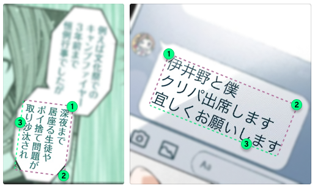

<!-- vim: set textwidth=80 colorcolumn=80: -->
<!-- markdownlint-configure-file
{
  "line-length": { "code_blocks": false },
  "no-inline-html": false
}
-->
# Kamite

> A desktop language immersion companion for learners of Japanese

<!-- -->

> **Note**
> This is alpha software.

Kamite is desktop software to aid learning Japanese through immersion in native
media. It brings Japanese text from those media into a web browser interface,
enabling lookup with pop-up dictionaries (such as [Yomichan](#pop-up-dictionary))
and websites (such as [DeepL Translate](#lookups)), and more.

<!-- markdownlint-capture --><!-- markdownlint-disable -->
https://user-images.githubusercontent.com/4130634/178029301-075cb207-a154-42d2-adb5-ce8fdbcd722f.mp4
<!-- markdownlint-restore -->

*(Featured in the above demo video: [All shots] Firefox, [Sway]. [Shot 1] [Gomics-v]
manga reader (Kaguya-sama wa Kokurasetai, ch. 140); [Yomichan] (dictionaries:
JMDict, Kanjium Pitch Accents, Narou Freq, VN Freq). [Shot 2] [mpv]
(Suzumiya Haruhi no Yuuutsu (2006), ep. 9). [Shot 3] Summer Pockets;
[Textractor];
[`contrib/kamite-toggle-visibility.sh`](contrib/kamite-toggle-visibility.sh)
script; [waycorner][waycorner-icxes].)*

## Highlights

* Use your existing installation of your favourite [pop-up dictionary
  extension](#pop-up-dictionary) (e.g., Yomichan, rikaikun,
  10ten Japanese Reader).

* [Extract text from images on screen](#mangavisual-text-extraction)
  (e.g., manga) with several third-party online and offline OCR solutions
  (e.g., “MangaOCR”, EasyOCR, Tesseract).

  Includes advanced features such as automatic text block detection and
  derotation of rotated text before further processing.

* Extract text from video subtitles as it is playing ([mpv player integration](#animevideo-text-extraction)).

* Extract text from games, visual novels, and other programs as they are running
  ([Textractor and Agent texthookers integration](#visual-novel--game-text-extraction)).

* Have the text [filtered and transformed using custom rules](#filtering-and-transforming-incoming-text)
  before it is displayed in the program.

* Freely [edit and transform the text manually](#editing-and-transforming-the-text)
  once it is displayed.

* Use the text for lookups on external websites (e.g., DeepL Translate, Google
  Images).

  You can have the websites embedded directly into Kamite’s UI, so that
    lookups do not require constant clicking around and switching windows/tabs.

* Easily [run external programs and scripts](#custom-commands-launching-external-executables),
  providing them the text as input.

  This enables countless custom integrations, e.g., [reading the text aloud
  using Microsoft’s text-to-speech service][wiki-linux-edge-tts].

* Send text and commands to Kamite from the oustide using [the provided
  API](#command-api).

  This enables still more custom integrations, e.g.:

  * [Gomics-v](#linux-manga-viewer-with-kamite-integration): A Linux manga
    reader able to send images to Kamite for OCR through a convenient
    one-mouse-key shortuct.

  * [kamite-watch-clipboard](#watcher-script): A system script that
    automatically sends clipboard contents as text to Kamite.

Kamite supports Linux\* and Windows (macOS support planned for the beta release).

*(\*Linux: Xorg, wlroots, GNOME Wayland, Plasma Wayland. OCR-ing arbitrary screen
areas not supported on GNOME Wayland and Plasma Wayland.)*

Kamite is cost-free and is licensed under the GNU AGPL v3 or later.

[deepl]: https://deepl.com/
[mpv]: https://mpv.io/
[Textractor]: https://github.com/Artikash/Textractor
[Agent]: https://github.com/0xDC00/agent
[waycorner-icxes]: https://github.com/icxes/waycorner
[wiki-linux-edge-tts]: https://github.com/fauu/Kamite/wiki/Linux-recipes#read-text-from-kamite-aloud-using-microsofts-tts

## Table of contents

1. [Installing Kamite](#installing-kamite)
    * [Linux](#linux)
    * [Windows](#windows)
1. [Updating Kamite](#updating-kamite)
    * [Linux Generic and Windows](#linux-generic-and-windows)
1. [Launching Kamite](#launching-kamite)
1. [Troubleshooting](#troubleshooting)
1. [User interface overview](#user-interface-overview)
1. [Text extraction](#text-extraction)
    * [Anime/video text extraction](#animevideo-text-extraction)
    * [Manga/visual text extraction](#mangavisual-text-extraction)
    * [Visual novel / game text extraction](#visual-novel--game-text-extraction)
    * [Clipboard](#clipboard)
    * [Custom source / alternative method text extraction](#custom-source--alternative-method-text-extraction)
    * [Filtering and transforming incoming text](#filtering-and-transforming-incoming-text)
1. [Text use](#text-use)
    * [Editing and transforming the text](#editing-and-transforming-the-text)
    * [Pop-up dictionary](#pop-up-dictionary)
    * [Lookups](#lookups)
    * [Auto-generated furigana](#auto-generated-furigana)
    * [Saving text to a file for external use](#saving-text-to-a-file-for-external-use)
    * [Custom text use](#custom-text-use)
1. [Custom commands (Launching external executables)](#custom-commands-launching-external-executables)
1. [Keyboard shortcuts](#keyboard-shortcuts)
    * [Client-only keyboard shortcuts](#client-only-keyboard-shortcuts)
    * [Global keyboard shortcuts](#global-keyboard-shortcuts)
1. [Launch options](#launch-options)
1. [Config](#config)
    * [Live reload](#live-reload)
    * [Full config example](#full-config-example)
    * [Substitution (variables)](#substitution-variables)
    * [Config profiles](#config-profiles)
1. [Style customization](#style-customization)
    * [Styling recipes](#styling-recipes)
1. [Command API](#command-api)
    * [Sending commands](#sending-commands)
    * [Command listing](#command-listing)
1. [Privacy](#privacy)
1. [Development](#development)
1. [License](#license)
    * [Third-party components](#third-party-components)

## Installing Kamite

### Linux

#### Arch User Repository

An AUR package is available under the name [kamite-bin] (installs to
`/opt/kamite`).

[kamite-bin]: https://aur.archlinux.org/packages/kamite-bin

#### Debian/Ubuntu-based

A Debian (`.deb`) package is available among the files on the [Releases] page.
Install with:

```sh
sudo apt install /path/to/[package-file].deb
```

Uninstall with:

```sh
sudo apt remove kamite-bin
```

#### Generic

Download the latest release package from the [Releases] page and extract it
to the location where you want to keep the program files. You can now launch
Kamite with the `bin/kamite` executable inside the extracted directory.

An optional `install.sh` script is provided in the release package that can
create a link to `bin/kamite` in the `/usr/bin/` directory, as well as install a
Desktop entry and program icons for application launchers. The files created by
the installation script can be removed by running:

```sh
install.sh --uninstall
```

### Windows

Download the latest release package from the [Releases] page and extract it
to the location where you want to keep the program files. You can now launch
Kamite using `Kamite.exe` inside the extracted directory.

[Releases]: https://github.com/fauu/Kamite/releases

## Updating Kamite

**When updating, please check [the Changelog](CHANGELOG.md) for breaking chages
in the newer versions.**

### Linux Generic and Windows

To update, remove the old `kamite` directory and extract the new release package
in its place.

## Launching Kamite

Kamite can be launched:

* <ins>Linux</ins>: either direclty using the `bin/kamite` executable in the
  program directory or through a desktop launcher (assuming the `.desktop` file
  was installed);

* <ins>Windows</ins>: using one of: `Kamite.exe`, `Kamite.com` (provides console
  output), or `Kamite (Debug).bat` (enables Debug mode and provides console
  output).

Besides the [config file](#config), Kamite supports configuration through
launch options. See [Launch options](#launch-options).

Kamite’s main user interface is a webpage served by a local server that should
be opened in your web browser. The default address is <http://localhost:4110>.

**The web client is only guaranteed to work without issues on the most recent
versions of Firefox and Chrome**.

Upon launch, Kamite will, by default: 1) navigate to the above address in the
default web browser, 2) open an auxiliary “Control” window, which lets you
monitor the program’s status as well as exit it. Both those behaviours can be
disabled by setting the [config keys](#config) `launchBrowser` and
`controlWindow`, respectively,  to `no`. Disabling the latter is useful when
Kamite is run from the command line, making the control window redundant.

Multiple config profiles can be prepared for Kamite and chosen between at the
time of its launch. See [Config profiles](#config-profiles).

## Troubleshooting

To better diagnose problems, launch Kamite from a console window with the
[launch option](#launch-options) `--debug`. (On Windows, this can be done simply
by double-clicking the provided `Kamite (Debug).bat` script). This will make
Kamite print detailed error messages and add a Debug tab to the client (the bug
icon) where image snapshots of OCR operations appear for inspection.

If something does not seem to work properly or is confusing in a way that is not
dispelled by what is written in this README, do not hesitate to [create a GitHub
Issue](https://github.com/fauu/Kamite/issues/new).

## User interface overview

<p align="center">
  
</p>

Below are some non-obvious tips regarding the interface that might come useful.

* Double-clicking on the *current chunk* activates the chunk edit mode. To exit
  it, either click away or press <kbd>Ctrl</kbd> + <kbd>Enter</kbd>.

* The *notebook* can be temporarily resized by dragging its edge with the mouse
  (in order for the setting to persist, however, it must be set in the [config
  file](#config)).

* You can have incoming text chunk inserted into the current chunk instead of
  entirely replacing it. To do that, enter the chunk edit mode as described
  above and either: 1) place the caret where you want the incoming chunk to be
  inserted or 2) select the part of the current chunk that you wish replaced
  with it.

* The *character counter* and the *session timer* can be frozen/paused and
  restarted by, respectively, short-clicking and long-clickng on them.

* The *session timer* can be set up to pause automatically after a period of
  inactivity. For example, add `sessionTimer.autoPause.after: 45s` to auto-pause
  after 45 seconds of inactivity.

* The *session timer* can be set to be paused initially after launching the
  program (`sessionTimer.startPaused: yes` to enable).

## Text extraction

The first task when using Kamite is to get text from the immersion material into
the program. In Kamite’s terminology, a single incoming piece of text is called
a **chunk**.

The method of getting text chunks into Kamite will depend on the kind of the
source material:

### Anime/video text extraction

Extracting text chunks from video is by default supported through integration
with the **[mpv]** video player. *Primary* video subtitles from mpv are treated
by Kamite as incoming chunks. If *secondary* subtitles are present, they are
treated as **chunk translations**.

To enable the connection between Kamite and mpv, the latter must be launched
with the following exact value for the `input-ipc-server` parameter:

<ins>Linux</ins>:

```sh
mpv file.mkv --input-ipc-server=/tmp/kamite-mpvsocket
```

<ins>Windows</ins> (PowerShell):

```powershell
C:\Program` Files\mpv\mpv file.mkv --input-ipc-server=\\.\pipe\kamite-mpvsocket
```

<br>

Alternatively, the line

```sh
input-ipc-server=<above_path>
```

can be put into the [mpv config file][mpv-ref-config].

In the former case, mpv will only be open for communication with Kamite when
launched with the specified parameter. In the latter—it will be open always.

> For more on the communication mechanism used, see the
[mpv reference for JSON IPC][mpv-ref-json-ipc].

To run mpv with an external subtitle file, use the `--sub-file` launch
parameter (it can be repeated for multiple subtitle files). To assign a given
subtitle track as *primary* (assumed by Kamite to be the Japanese subtitles) and
*secondary* (assumed to be the translations), respectively, use the `--sid` and
`--secondary-sid` mpv launch parameters. Which subtitle IDs to specify can be
glanced by pressing <kbd>F9</kbd> in mpv while the video file is opened and the
subtitles loaded.

> **Note**
> Subtitles hidden within mpv will still be recognized by Kamite.

<!-- -->

> **Warning**
> The subtitle extraction functionality will not work with subtitles that
> are stored as images, not as text.

<!-- -->

> See also: [mpv reference: Subtitle options][mpv-ref-sub-options].

Below are excerpts from example scripts used to quickly launch an anime episode
in mpv in such a way that it is immediately set up to work with Kamite.

<ins>Linux</ins>:

<!-- markdownlint-capture --><!-- markdownlint-disable -->
```sh
mpv "/path/to/video/"*"Some Anime Name"*"E$1"*".mkv" \ # Episode no. passed as an argument to the script
  --input-ipc-server=/tmp/kamite-mpvsocket \
  --sub-file="/path/to/external/subtitles/$1.jp.srt" \
  --sid=2 \ # ID of the Japanese subtitles provided externally
  --secondary-sid=1 \ # ID of the English subtitles embedded in the video file (to be used as translations)
  --secondary-sub-visibility=no \
  --save-position-on-quit \
  --profile=jpsub # An optional custom profile that can set a special subtitle font and size, etc. It must be defined separately in the mpv config file: see https://mpv.io/manual/stable/#profiles
```
<!-- markdownlint-restore -->

<ins>Windows</ins> (PowerShell):

```powershell
# See the Linux example above for more information
param ([String] $ep) # $ep will be replaced with the first parameter to the
                     # script (here assumed to be the episode number)
C:\Program` Files\mpv\mpv "\path\to\video\*Some Anime Name*E$ep.mkv" `
  --input-ipc-server=\\.\pipe\kamite-mpvsocket `
  --sub-file="\path\to\external\subtitles\$ep.jp.srt" `
  --sid=2 `
  --secondary-sid=1 `
  --secondary-sub-visibility=no `
  --save-position-on-quit `
  --profile=jpsub
```

---

#### Tip: Auto-pausing at the start/end of subtitles

This can be useful for beginners whose comprehension is not yet at the level
needed to follow even simple video content at natural pace. The
[sub-pause-advanced] mpv script can be used for this purpose. Here are some
example learning workflows enabled by that script:

* Pause at the end of each Japanese subtitle in order to read it in Kamite.
  (Useful when you cannot read proper texts yet and it is advantageous to
  substitute with short anime dialogues.)

* Do the above, but only when you stumble while reading the subtitle live and
  you explicitly request pause at the end of the subtitle by pressing a defined
  request key. (Useful once you progress to the level at which you can often
  read easier lines live.)

* Pause at the start of each {known language} subtitle and automatically unpause
  after the time sufficient to read it (calculated by the script based on the
  subtitle’s length), so that you can then fully concentrate on understandning
  the Japanese spoken line, with the comprehension “training wheel” in the form
  of knowing roughly what it’s supposed to say. (Useful for beginner listening
  practice.)

For more information, see the script’s README in its GitHub repository linked
above.

---

Kamite can be useful even when viewing media without Japanese subtitles, for
example as an area where heard words and phrases can be typed in and looked up.

When viewing media with translated subtitles only, Kamite can be instructed to
treat them as translations for unknown chunks and display them as such, by
enabling “Translation-only mode” in the Settings tab or by launching with the
config key `chunk.translationOnlyMode` set to `yes`.

[mpv-ref-config]: https://mpv.io/manual/stable/#configuration-files
[mpv-ref-json-ipc]: https://mpv.io/manual/stable/#json-ipc
[mpv-ref-sub-options]: https://mpv.io/manual/stable/#subtitles
[sub-pause-advanced]: https://github.com/fauu/mpv-sub-pause-advanced

---

**Related Wiki sections:**

* [Mining anime/video with Anacreon’s mpv script](https://github.com/fauu/Kamite/wiki/Mining-recipes#anacreons-mpv-script)
* [Alternative software for anime/video](https://github.com/fauu/Kamite/wiki/Alternative-software#animevideo)

### Manga/visual text extraction

Kamite integrates with several alternative OCR (Optical Character Recognition)
solutions to enable visual extraction of text from manga pages and other
content displayed on screen. The available OCR engines are:

* “Manga OCR” Online (a Hugging Face Space by Detomo)

    <https://github.com/kha-white/manga-ocr>\
    <https://huggingface.co/spaces/Detomo/Japanese-OCR>

* “Manga OCR” (Local)

    <https://github.com/kha-white/manga-ocr>

* Hive OCR Online (a Hugging Face Space by seaoctopusredchicken)

    **(horizontal text only)**

    <https://huggingface.co/spaces/seaoctopusredchicken/Hive-OCR-simple>\
    <https://thehive.ai/demos?case_study=text_recognition>

* EasyOCR Online (a Hugging Face Space by tomofi)
  
    **(horizontal text only)**

    <https://huggingface.co/spaces/tomofi/EasyOCR>\
    <https://github.com/JaidedAI/EasyOCR>

* OCR.space (Online)

    <https://ocr.space/>

* Tesseract OCR (Local)

    <https://github.com/tesseract-ocr/tesseract>

**“Manga OCR” in either variant is the recommended choice for manga**.
The online version requires practically no special setup, but involves
screenshots of portions of your screen being sent to a third party. The local
version, on the other hand, requires a somewhat involved setup and extra system
resources.

**By default, OCR is disabled.** The necessary setup steps are:

1. Set the [config](#config) key `ocr.engine` to one of: `mangaocr_online`,
   `mangaocr`, `hiveocr_online`, `easyocr_online`, `ocrspace`, or `tesseract`.

1. Set up the selected engine:

    * [Setting up “Manga OCR” Online](#setting-up-manga-ocr-online)
    * [Setting up “Manga OCR”](#setting-up-manga-ocr-local)
    * [Setting up Hive OCR Online](#setting-up-hive-ocr-online)
    * [Setting up EasyOCR Online](#setting-up-easyocr-online)
    * [Setting up OCR.space](#setting-up-ocrspace)
    * [Setting up Tesseract OCR](#setting-up-tesseract-ocr)

1. (Linux/Xorg and wlroots platforms only)
[Set up extra OCR dependencies](#setting-up-extra-ocr-dependencies)

#### Setting up “Manga OCR” Online

> **Warning**
> The “Manga OCR” Online engine depends on a third-party online service
> ([a Hugging Face Space by Detomo][manga-ocr-hf])—using it involves sending
> screenshots of portions of your screen to third parties. (See
> [Privacy](#privacy))

The “Manga OCR” Online does not require any extra setup.

Remember to [set up extra OCR dependencies](#setting-up-extra-ocr-dependencies)
if necessary, and to launch Kamite with the config key `ocr.engine` set to
`mangaocr_online`.

#### Setting up “Manga OCR” (Local)

> **Note**
> “Manga OCR” will use up to 2.5 GB of disk space. During launch, it will use up
> to 1 GB of additional RAM.

##### Recommended option: installation using pipx

1. Install [Python][installing-python] and [pip] (the Windows Python installer
   already includes pip)

1. Install [pipx]

    <ins>Windows</ins>:

    ```powershell
    C:\Users\<user>\AppData\Local\Programs\Python\Python310\python.exe -m pip
    install --user pipx
    ```

    The `python.exe` location will vary depending on the installer and the
    installation options.

1. Install [manga-ocr]

    <ins>Linux</ins>:

    ```sh
    pipx install manga-ocr
    ```

    <ins>Windows</ins>:

    ```powershell
    C:\Users\<user>\AppData\Local\Programs\Python\Python310\python.exe -m pipx
    install manga-ocr
    ```

Kamite will now be able to use “Manga OCR”. On the first launch of Kamite with
`ocr.engine` set to `mangaocr`, “Manga OCR” will take some time to download its
model (around 450 MB). If there are issues, try running the (<ins>Linux</ins>)
`manga_ocr`, (<ins>Windows</ins>)
`C:\Users\<user>\.local\pipx\venvs\manga-ocr\Scripts\manga_ocr.exe` executable
installed by pipx and examining its output.

###### Deinstallation

1. Run `pipx uninstall`

    <ins>Linux</ins>:

    ```sh
    pipx uninstall manga-ocr
    ```

    <ins>Windows</ins>:

    ```powershell
    C:\Users\<user>\AppData\Local\Programs\Python\Python310\python.exe -m pipx
    uninstall manga-ocr
    ```

1. Delete leftover Hugging Face Hub files:

(<ins>Linux</ins>) `~/.cache/huggingface/hub/models--kha-white--manga-ocr-base`
or a ~450 MB file in `~/.cache/huggingface/transformers/`.

(<ins>Windows</ins>)
`C:\Users\<user>\.cache\huggingface\hub\models--kha-white--manga-ocr-base` or a
~450 MB file in `C:\Users\<user>\.cache\huggingface\transformers`.

###### Troubleshooting “pipx "Manga OCR" installation absent…”

If pipx did not install to the default path expected by Kamite, you will have to
specify the path manually in the [config file](#config):

```sh
ocr: {
  mangaocr: {
    # Linux default
    pythonPath: "/home/<user>/.local/pipx/venvs/manga-ocr/bin/python"
    # Windows default
    pythonPath: """C:\Users\<user>\.local\pipx\venvs\manga-ocr\Scripts\python.exe"""
  }
}
```

**The above paths are the defaults, which you will need to modify** according to
the output you get from running

<ins>Linux</ins>:

```sh
pipx list
```

<ins>Windows</ins>:

```powershell
C:\Users\<user>\AppData\Local\Programs\Python\Python310\python.exe -m pipx
list
```

[installing-python]: https://realpython.com/installing-python/
[pip]: https://pip.pypa.io/en/stable/installation/
[pipx]: https://pypa.github.io/pipx/

##### Custom installation

If you install “Manga OCR” not through pipx, you will need to manually specify a
path to a Python main executable (or a wrapper for it) that runs within an
environment where the `manga_ocr` module is available. For example, if installed
globally and the system Python executable is on `PATH` under the name `python`,
then the appropriate configuration will be simply:

```sh
ocr: {
  mangaocr: {
    pythonPath: python
  }
}
```

> **Note**
> After deinstallation, there will be a ~450 MB leftover model file in
> (<ins>Linux</ins>) `~/.cache/huggingface/transformers/`, (<ins>Windows</ins>)
> `C:\Users\<user>\.cache\huggingface\transformers`.

#### Setting up Hive OCR Online

> **Warning**
> The Hive OCR Online engine depends on a third-party online service ([a Hugging
> Face Space by seaoctopusredchicken][hiveocr-hf])—using it involves sending
> screenshots of portions of your screen to third parties. (See
> [Privacy](#privacy))

The Hive OCR Online engine does not require any extra setup.

Remember to [set up extra OCR dependencies](#setting-up-extra-ocr-dependencies)
if necessary, and to launch Kamite with the config key `ocr.engine` set to `hiveocr_online`.

#### Setting up EasyOCR Online

> **Warning**
> The EasyOCR Online engine depends on a third-party online service ([a Hugging
> Face Space by tomofi][easyocr-hf])—using it involves sending screenshots
> of portions of your screen to third parties. (See [Privacy](#privacy))

The EasyOCR Online engine does not require any extra setup.

Remember to [set up extra OCR dependencies](#setting-up-extra-ocr-dependencies)
if necessary, and to launch Kamite with the config key `ocr.engine` set to
`easyocr_online`.

#### Setting up OCR.space

> **Warning**
> OCR.space is an online service—using it involves sending screenshots of
> portions of your screen to a third party. (See [Privacy](#privacy))

The usage of the [OCR.space] free API is limited. The limits are defined by the
provider as “Requests/month: 25000, Rate Limit: 500 calls/DAY”.

1. Register for a free API key

    Fill the form at <https://ocr.space/ocrapi/freekey>. You will need to
    provide your email address, to which the key will be sent.

1. Put the API key in Kamite’s [config file](#config):

    > **Warning**
    > This is unsafe plain-text storage. Do not do this if you deem your key too
    > sensitive for this kind of storage.

    ```sh
    secrets: {
      ocrspace: "THE KEY GOES HERE"
    }
    ```

1. (Optional—for games) Change the subengine from the default (“1”)

    The OCR.space service itself provides multiple OCR engines. Japanese is
    supported by engines “1” and “3”. Kamite uses engine “1” by default. If you
    wish to use engine “3”, specify the following configuration:

    ```sh
    ocr: {
      ocrspace: {
        engine: 3
      }
    }
    ```

    Engine “3” is useless for manga and slower than engine “1”, but it may be
    more accurate for, e.g., particular games.

Remember to [set up extra OCR dependencies](#setting-up-extra-ocr-dependencies)
if necessary, and to launch Kamite with the config key `ocr.engine` set to
`ocrspace`.

[ocrspace-privacy-policy]: https://ocr.space/privacypolicy

#### Setting up Tesseract OCR

1. Install Tesseract

    <ins>Linux</ins>: Tesseract is available in the default repositories of most
    distributions. For example, under `tesseract-ocr` on Ubuntu or under
    `tesseract` on Arch Linux.

    <ins>Windows</ins>: It is recommended to use [the installer provided by
    UB Mannheim][tesseract-ub-mannheim].

1. Install Tesseract models selected for use with Kamite

    Download
    [`tesseract_traineddata_jpn_Kamite.zip`](https://mega.nz/file/1TMXxApD#zHdgnXmbuMc5TRTcBlT7a5_8t2E1ziSxnhf9c2PbtP4)
    and extract the `.traineddata` files from the archive *directly* into
    Tesseract’s `tessdata` directory:

    * <ins>Linux</ins>: usually `/usr/[local/]share/tessdata` or
    `/usr/share/tesseract-ocr/<VERSION>/tessdata`;

    * <ins>Windows</ins>: the default for the UB Mannheim installer is
      `C:\Program Files\Tesseract-OCR\tessdata`.

1. If Tesseract is not available on `PATH` under the executable name
   `tesseract` (which it will not on Windows), set the [config](#config) key
   `ocr.tesseract.path` to its executable’s path:

   <ins>Windows</ins> (UB Mannheim installer default):

   ```sh
   ocr: {
     tesseract: {
       path: """C:\Program Files\Tesseract-OCR\tesseract.exe""" # Note the triple quotes
     }
   }
   ```

Once the setup has been completed, you can launch Kamite with the config key
`ocr.engine` set to `tesseract`.

[tesseract-ub-mannheim]: https://github.com/UB-Mannheim/tesseract/wiki

#### Setting up extra OCR dependencies

On some platforms, external programs are needed for text recognition related
tasks. You need to install them on your own.

##### Linux/Xorg extra OCR dependencies

<dl>
  <dt><a href="https://github.com/naelstrof/slop">slop</a></dt>
  <dd>Used for selecting a screen region or point.</dd>
</dl>

##### Linux/wlroots extra OCR dependencies

<dl>
  <dt><a href="https://github.com/emersion/slurp">slurp</a></dt>
  <dd>Used for selecting a screen region or point.</dd>
  <dt><a href="https://sr.ht/~emersion/grim/">grim</a></dt>
  <dd>Used for taking screenshots for OCR.</dd>
  <dt><a href="https://git.sr.ht/%7Ebrocellous/wlrctl">wlrctl</a></dt>
  <dd>(Optional) Necessary to trigger a mouse click for OCR Auto Block Instant
  mode.</dd>
</dl>

#### OCR usage

Text recognition can be initiated by:

* Issuing an OCR command through:
  * clicking the corresponding button in the command
    palette,
  * pressing the configured [keyboard shortcut](#keyboard-shortcuts), or
  * [sending the command through the API](#command-api).
* Adding or modifying an image in a directory provided to the [OCR directory
  watcher](#ocr-directory-watcher).

> **Note**
> **On Linux / GNOME Wayland and Plasma Wayland**, only the following of
> the above are available:
>
> * the [`ocr_image` command](#ocr_-commands) (including external software that
>   uses it, for example [Gomics-v]),
> * the [OCR directory watcher](#ocr-directory-watcher).

The OCR commands directly available to the user are the following:

##### Manual block OCR

<!-- markdownlint-capture --><!-- markdownlint-disable -->
  
<!-- markdownlint-restore -->

Select an area around a block of text and Kamite will OCR the area as is.

For the `tesseract` engine, this command has separate vertical and horizontal
variants that must be chosen manually depending on the orientation of the text
block.

##### Auto block OCR


Select a point within a block of text; Kamite will try to infer the extent of
the block and then OCR the resulting area.

*This should be good enough for > 90% of typical manga text blocks, but the
block detection algorithm has a lot of room for improvement.*

> **Note**
> (Linux/Xorg) On Xorg, the point selection mechanism cannot be restricted to
> just a point, meaning that when the mouse is pressed and dragged, a rectangle
> area will be selected instead of a point. If this happens, Kamite will
> consider the center of this area as the selected point.

##### Manual rotated block OCR


Delimit a rotated block of text; Kamite will derotate the resulting area
selection and OCR it.

The delimitation of a rotated block is made with three mouse clicks in
determined spots, as shown in the following illustrations:



Clicks 1 and 2 must be made at the start and end of the initial edge of the text
respectively. Click 3 can be anywhere along the closing edge (pictured as green
above).

> **Note**
> The current implementation of rotated block OCR guesses the text orientation
> based on the rotation angle. This means the feature will fail in unusual cases,
> such as a block of horizontal text positioned vertically. The current
> assumption is that those cases are very rare, but if you find use-cases where
> they are not, please [create a GitHub Issue](https://github.com/fauu/Kamite/issues/new)
> so that the assumption can be updated and the implementation reconsidered.


##### Region OCR


Define a screen area in the config file and Kamite will OCR it as is [using the
configured OCR engine](#mangavisual-text-extraction).

This is intended as an alternative for games that do not work with
[Textractor](#textractor-integration) or [Agent](#agent-integration).

Here it is recommended to try OCR engines in the following order: Hive OCR,
EasyOCR, OCR.space, and “Manga OCR” (in terms of the likelihood that they are
going to be up to the task). (For OCR.space, be sure to try
[OCR.space engine “3”](#setting-up-ocrspace) specifically).

Below is an illustration of setting up a region in the [config file](#config).

```sh
ocr: {
  regions: [
    ${REGIONS.exampleGameTextbox}
    ${REGIONS.someOtherRegionOmittedBelow}
  ]
}

REGIONS: [
  exampleGameTextbox: {
    # (1 character) This symbol will appear on the region’s button
    symbol: E

    # This description will appear in the region’s button tooltip
    description: "OCR Example Game's textbox"

    # The screen coordinates of the region’s top-left corner
    x: 350
    y: 800

    # The screen dimensions of the region
    width: 1000
    height: 150

    # Try to automatically narrow the region’s screenshot to just text before
    # OCR-ing it.
    # NOTE: The implementation of this function is currently very basic. It
    #       might not prove helpful in most use-cases
    autoNarrow: no
  }
]

keybindings: {
  global: {
    ocr: {
      region: [
        # Global keybinding for the above-defined region
        { symbol: E, key: meta shift E }
      ]
    }
  }
}
```

###### Obtaining region parameters

To obtain the desired region coordinates and dimensions, use Kamite’s Region
Helper mode: Launch Kamite from console with the launch option `--regionHelper`,
select the desired areas, and copy the resulting region specifications from the
console output.

> **Note**
> (Windows) To get console output on Windows, you must launch Kamite using the
> `Kamite.com` executable, not `Kamite.exe`.

###### Region OCR quality

Some of the engines that can potentially handle this specific task work much more
reliably when the screenshot they are provided with is narrowed to just the text.
And since the current auto-narrowing algorithm is poor, for now it might be
best—when necessary—to create separate regions for each possible line count of
the target text box (i.e., first region encompassing just one line of text,
second region encompassing the first and the second line, and so on) and choose
between them on the fly.

See also: [Config](#config), [Visual novel / game text extraction](#visual-novel--game-text-extraction),
[Alternative software for visual novels / games](https://github.com/fauu/Kamite/wiki/Alternative-software#visual-novels--games).

---

##### Using alternative OCR variants (Tesseract OCR only)

When using the Tesseract OCR engine, Kamite executes Tesseract multiple times
for each OCR request on modified versions of the input image. This is in order
to somewhat compensate for the inferior results Tesseract gives.

When all the resulting text variants are identical, they are simply merged and
presented as one. When there are differing alternative variants, however, the
one determined the most likely to be the most accurate is displayed normally as
the *current chunk*, whereas the remaining variants appear under a new *OCR
Variants* tab placed at the left edge of the notebook’s tab bar.

Through the OCR Variants view, you can replace the current chunk with one of the
other variants by clicking the Pick button next to the corresponding variant.
You can also make text selections within both the current chunk and the
variants, which, upon clicking the Pick button, will lead to a partial text
replacement.

The OCR Variants view highlights characters that are unique to its variant to
make it easier to identify potential replacements for a misrecognized character
in the current chunk.

#### OCR directory watcher

Kamite can watch a specified directory for new/modified images and perform text
recognition on them automatically. This is especially useful for platforms that
do not support global OCR commands (Linux / GNOME Wayland and Plasma Wayland).

To enable the directory watcher, specify the directory path in the [config
file](#config):

```sh
ocr: {
  watchDir: "/full/path/to/the/directory" # Linux variant
  watchDir: """C:\path\to\the\directory""" # Windows variant
}
```

This can be used in conjunction with a platform-specific screenshot tool, for
example [GNOME Screenshot] on GNOME Wayland and [Spectacle] on Plasma Wayland.

Note that Kamite treats the entire input image as a single text block.
Consequently, the provided images should be area screenshots containing just the
text block to be recognized—not the entire screen or application window.

[GNOME Screenshot]: https://en.wikipedia.org/wiki/GNOME_Screenshot
[Spectacle]: https://apps.kde.org/spectacle/

#### Web browser userscript for convenient OCR

*Kamite One-Click OCR* is a simple browser userscript that enables convenient
shortcuts for issuing OCR commands to Kamite (useful when reading manga directly
in the browser):

* *Middle-click* on a text block to automatically recognize it.

* *Middle-hold-click* anywhere within the webpage to initiate a manual block
  recognition selection.

To install the script, first install a userscript browser extension such as
[Violentmonkey] or [Tampermonkey], and then follow this link: [Kamite One-Click OCR.user.js][oneclick-ocr-userscript].

Then **you need to specify on which websites the script will be active**:

1. Open your userscript browser extension.

1. Click on the cog icon (“Open dashboard”).

1. Find *Kamite One-Click OCR* and edit it:

    Tampermonkey: Click on the script name.\
    Violentmonkey: Click the `</>` (“Edit”) icon below the script name.

1. Switch to the `Settings` tab.

1. Add user match rules for desired websites.

    Example configuration enabling the script on two specific websites:

    Enter under `User matches` (Tampermonkey) or `@match rules` (Violentmonkey):

    ```txt
    https://twitter.com/*
    https://metaurl.app/*
    ```

On first use, you might be prompted to confirm that you allow the script to make
web requests to Kamite’s backend server.

You can switch to using the right mouse button instead of the middle by going to
the `Code` tab and changing `const MOUSE_BUTTON = 1` to say `= 2`. Note that
this will disable the browser context menu that normally opens on right-click.

[oneclick-ocr-userscript]: https://github.com/fauu/Kamite/raw/master/extra/userscripts/Kamite%20One-Click%20OCR.user.js

#### Linux manga viewer with Kamite integration

[Gomics-v] is a manga viewer for Linux that includes simple Kamite integration:

* *Right-click* on a text block to automatically recognize it.

* *Right-hold-click* anywhere in the area where images are displayed to
  initiate a manual block recognition selection.

The integration must be enabled in Gomics-v under `Preferences › Kamite`.

---

**Related Wiki sections:**

* [Anki mining screenshot script (Linux/wlroots and Xorg)](https://github.com/fauu/Kamite/wiki/Mining-recipes#screenshot-script-linuxwlroots-and-xorg)
* [Quickly trigger OCR with mouse hot corners (Linux/wlroots)](https://github.com/fauu/Kamite/wiki/OCR-recipes#quickly-trigger-ocr-with-mouse-hot-corners-linuxwlroots)
* [Alternative software for manga](https://github.com/fauu/Kamite/wiki/Alternative-software#manga)

### Visual novel / game text extraction

Kamite can receive text extracted from other programs through **[Textractor]**
and **[Agent]** text extractor programs:

* [Textractor integration](#textractor-integration)
* [Agent integration](#agent-integration)

There is also a RPG Maker MV/MZ plugin that can directly extract text from games
using those engines: see
[`contrib/KamiteSendRPGMaker.js`](contrib/KamiteSendRPGMaker.js) (usage
instructions are in the plugin file).

Other integrations can be created using the [Command API](#command-api).

> **Note**
> For games that cannot be integrated using the above means, the
> [Region OCR](#region-ocr) feature might prove an alternative.

#### Textractor integration

An extension for [Textractor] is available that sends lines of text
extracted by it from other programs to Kamite.

To install the *Kamite Send* Textractor extension:

1. Copy `Kamite Send.xdll` from either the `extra/textractor/x86` (32-bit
   Textractor) or `extra/textractor/x64` (64-bit Textractor) within the release
   package to the main Textractor directory (the one containing
   `Textractor.exe`).

   > **Note**
   > If you installed Kamite from AUR, the files will be in `/opt/kamite`.

2. In Textractor, press the `Extensions` button, right-click in the extension
   list, choose `Add extension` and select the `Kamite Send.xdll` file copied
   earlier.

For Textractor’s text processing extensions (such as Remove Repeated Characters)
to be executed before sending the text to Kamite, position Kamite Send *below*
them on the extensions list.

> Want to prevent Textractor from inserting unnecessary hooks? Check out
> [Textractor-HookAllowlist](https://github.com/fauu/Textractor-HookAllowlist/).

##### Changing the default Textractor extension endpoint

By default, the extension expects Kamite to listen for commands at the address
`localhost:4110`. If it is running on a different address (e.g., because you
have Textractor in a virtual machine and Kamite on the host), the extension
needs to be configured correspondingly. To do so, create a `Kamite Send.txt`
file next to `Kamite Send.xdll` in the Textractor directory, containing Kamite’s
network address from the perspective of the machine running Textractor, e.g.:

```txt
host=192.0.0.10:4110
```

#### Agent integration

To receive text (and, optionally, machine translations) from the [Agent] text
extractor:

1. Add `integrations.agent.enable: yes` to [config](#config).

2. In Agent, go to `Translate` tab and enable the option `WebSocketServer` (you
   can then browse to <http://127.0.0.1:9001/> to confirm that it is enabled).

With this setup, Kamite should receive text from Agent.

> **Note**
> (Linux) To hook Wine games, you can run the Windows version of Agent through
> Wine (you might need an older version of Wine, such as 6.14).

---

**Related Wiki sections:**

* [Anki mining screenshot script (Linux/wlroots and Xorg)](https://github.com/fauu/Kamite/wiki/Mining-recipes#screenshot-script-linuxwlroots-and-xorg)
* [Alternative software for visual novels / games](https://github.com/fauu/Kamite/wiki/Alternative-software#visual-novels--games)

### Clipboard

Text can be pasted from clipboard by pressing <kbd>Ctrl</kbd> + <kbd>V</kbd> in
Kamite’s browser tab.

The Kamite browser client can automatically pick up clipboard text with a
clipboard inserter browser extension ([Firefox][clipboard-inserter-ff],
[Chrome][clipboard-inserter-chrome]) (assumes default extension settings).

#### Watcher script

Clipboard can also be watched automatically without the Clipboard Inserter
extension, but with a clipboard watcher script that sends changed clipboard
content to Kamite:

* <ins>Linux</ins> (except GNOME Wayland):
[`contrib/kamite-watch-clipboard.sh`](contrib/kamite-watch-clipboard.sh).

* <ins>Windows</ins>:
[`contrib/Kamite-Watch-Clipboard.ps1`](contrib/Kamite-Watch-Clipboard.ps1) (run
with `Right click › Run with PowerShell`).

[clipboard-inserter-ff]: https://addons.mozilla.org/en-US/firefox/addon/lap-clipboard-inserter
[clipboard-inserter-chrome]: https://chrome.google.com/webstore/detail/clipboard-inserter/deahejllghicakhplliloeheabddjajm

### Custom source / alternative method text extraction

Custom sources and alternative text extraction methods can be integrated using
the [Command API](#command-api).

### Filtering and transforming incoming text

Kamite has the ability to discard incoming chunks that match a user-provided
pattern and to perform text replacements on incoming chunks according to
user-provided rules.

Both features are based on *regular expressions*, which can be learned using the
following resources:

* [RegexOne] — interactive regular expression tutorial.
* [regex101] — regular expression tester and explainer.

> **Note**
> The particular regular expression engine used by Kamite is Java’s, which
> has some particularities. Therefore, [Java’s own regular expression reference][java-regex]
> might also come useful (note that [regex101] can be instructed to use the Java
> flavour of regex through the menu on the left side of the page).

[RegexOne]: https://regexone.com/
[regex101]: https://regex101.com/
[java-regex]: https://docs.oracle.com/en/java/javase/18/docs/api/java.base/java/util/regex/Pattern.html#sum

#### Filtering chunks

To enable the chunk filter, specify chunk reject patterns in the [config](#config)
(`chunk.filter.rejectPatterns`). The patterns are regular expressions against
which incoming chunks will be tested. If any part of the chunk matches against
any of the patterns, the entire chunk will be discarded. For exmple, the
following configuration:

```sh
chunk: {
  filter.rejectPatterns: [
    "^Textractor"
    "(?s).{91}"
  ]
}
```

will discard both chunks beginning with the string of characters `Textractor`
and chunks that are above 90 characters in length. *The first of those filters is
already included in the [default config] that is created automatically when no
config file exists.*

> **Note**
> Regular expressions containing the backslash (`\`) character must (generally)
> be specified within triple instead of single quotes (that is, `"""` instead of
> `"`). See the section Transforming chunks (following) for an example.

<!-- -->

> **Note**
> **Kamite will automatically reload the patterns once a config file is
> modified.** There is no need to restart the program. The simplest way to test
> the filter is by pasting (<kbd>Ctrl</kbd> + <kbd>V</kbd>) prepared chunks into
> the client’s browser tab and observing whether they are allowed through.

[default config]: https://github.com/fauu/Kamite/blob/master/config/config.default.hocon

#### Transforming chunks

To enable the chunk transformer, specify chunk transform rules in the
[config](#config) (`chunk.transforms`). The rules are objects consisting of: 1)
a regular expression defining the replacement target, 2) a string specifying
the replacement text. For example, the following configuration:

```sh
chunk: {
  transforms: [
    { replace:  """\R""", with: "" }
    { replace: ".+?「(.+?)」$", with: "$1" }
  ]
}
```

will remove (replace with an empty string) any line break characters as well as
remove the names of speakers and quotation marks from dialogue lines formatted
as `<name>「<dialogue>」` (this will be replaced with just `<dialogue>`. The
`$1` in the `with` field is a special reference that will be replaced with the
text captured in the first and only [match group][regex-match-groups] defined
within the `replace` field). The rules will be applied in the specified order.

> **Note**
> Regular expressions containing the backslash (`\`) character must (generally)
> be specified within triple instead of single quotes (that is, `"""` instead of
> `"`). See the first transform in the example above for illustration.

<!-- -->

> **Note**
> **Kamite will automatically reload the transform definitions once a config
> file is modified.** There is no need to restart the program. The simplest way
> to test the transforms is by pasting (<kbd>Ctrl</kbd> + <kbd>V</kbd>) prepared
> chunks into the client’s browser tab and observing whether they come out
> modified as expected.

[regex-match-groups]: https://regexone.com/lesson/capturing_groups

## Text use

What can be done with the text once it has been collected into the program?

### Editing and transforming the text

Depending on the source and the extraction method, the text coming into the
program might contain mistakes or other features that need to be changed for it
to be usable further. Kamite offers various text editing and transformation
features that might be useful for that task.

The main chunk text can be selected character by character using the mouse and
transformed using actions that appear in the *action palette* near it, which are
made available depending on the existence and the content of the selection.
Characters can also be deleted by pressing <kbd>Delete</kbd> or
<kbd>Backspace</kbd>.

To enter chunk edit mode, which allows for direct insertion of typed text,
double-click the main area or press <kbd>Ctrl</kbd> + <kbd>Enter</kbd>
(+ <kbd>Shift</kbd> to clear). To exit it, click away from the input field or
press <kbd>Ctrl</kbd> + <kbd>Enter</kbd>.

### Pop-up dictionary

The basic task around which Kamite is designed is using a third-party pop-up
dictionary browser extension to learn through deciphering text you understand
only partially. The examples of such extensions are [Yomichan], [rikaikun], and
[10ten Japanese Reader][10ten].

For Yomichan, [its website][Yomichan] contains a basic installation and usage
guide. Additional dictionaries and setup tips for can be found in other places,
such as [Animecards: Setting up Yomichan][animecards-yomichan],
[TheMoeWay: Yomichan Setup Tutorial][themoeway-yomichan], or [Anacreon DJT:
Yomichan Frequency Dictionaries][anacreon-yomichan-freq].

[animecards-yomichan]: https://animecards.site/yomichansetup/
[themoeway-yomichan]: https://learnjapanese.moe/yomichan/
[anacreon-yomichan-freq]: https://anacreondjt.gitlab.io/docs/freq/

### Lookups

You can use the text chunks within Kamite as inputs for lookups on external
websites. The text that will be used as the lookup input normally corresponds to
the selection in the *chunk history* window, which, absent user intervention, is
the entire current chunk. If instead there is an active text selection within
the current chunk, it is only the selection that will be used for lookups.

By default, Kamite embeds the following sites for quick lookups:
<https://www.deepl.com/>, <https://ichi.moe/>, <https://jpdb.io/>. It also by
default provides a button for Google Images lookup in a new browser tab.

Optional userscripts are provided for the embedded sites that modify their look
when embedded into Kamite to improve their user experience. To install or update
the scripts, first install a userscript browser extension such as [Violentmonkey]
or [Tampermonkey], and then open the links below and follow the prompt.

* [Kamite DeepL mod](https://github.com/fauu/Kamite/raw/master/extra/userscripts/Kamite%20DeepL%20mod.user.js)

* [Kamite ichi.moe mod](https://github.com/fauu/Kamite/raw/master/extra/userscripts/Kamite%20ichi.moe%20mod.user.js)

* [Kamite jpdb mod](https://github.com/fauu/Kamite/raw/master/extra/userscripts/Kamite%20jpdb%20mod.user.js)

**DeepL and jpdb require yet another intervention to work**. A browser extension
to slightly modify the responses from those sites is required to make them available
for embedding.

1. Install the SimpleModifyHeaders browser extension
([Firefox][modify-headers-ff], [Chrome][modify-headers-chrome])

1. In the extension’s configuration screen, set the field *Url Patterns* to
   `https://www.deepl.com/*;https://jpdb.io/*`

1. Below that, enter the following parameters (for DeepL):

    | Field              | Value                     |
    |--------------------|---------------------------|
    | Action             | `Delete`                  |
    | Header Field Name  | `content-security-policy` |
    | Apply on           | `Response`                |

1. Click *New line* and enter the following into the second line of fields (for
   jpdb):

    | Field              | Value                     |
    |--------------------|---------------------------|
    | Action             | `Delete`                  |
    | Header Field Name  | `X-Frame-Options`         |
    | Apply on           | `Response`                |

1. **Click *Save***.

1. **Click *START*** in the top-right corner.

   DeepL and jpdb embeds should now work.

Alternatively, you can have DeepL and jpdb lookups open in a new browser tab by
simply adding the line `newTab: yes` to the corresponding lookup [config
entries](#config).

#### Custom lookups

Kamite supports adding custom lookups. Below is an illustration of the process
using the website [Immersion Kit] as an example lookup target.

1. Add an object describing the target to the `LOOKUP_TARGETS` object in the
main config file:

    ```sh
    LOOKUP_TARGETS: {
      # This key can be anything
      immersionKit: {
        # (1-3 characters) The symbol will appear on the lookup button
        symbol: IMK
    
        # The name will appear in the lookup button’s tooltip
        name: Immersion Kit
    
        # {} is a placeholder that will be replaced with the lookup text
        url: "https://www.immersionkit.com/dictionary?keyword={}"
    
        # (Optional) Whether to open the lookup in a new browser tab or embedded
        newTab: yes
      }
    }
    ```

2. Add the above-created lookup target to the `lookup.targets` list:

    ```sh
    lookup: {
      targets: [
        ${LOOKUP_TARGETS.immersionKit} # Has to match the key defined above
      ]
    }
    ```

[Violentmonkey]: https://violentmonkey.github.io/
[Tampermonkey]: https://tampermonkey.net
[modify-headers-ff]: https://addons.mozilla.org/firefox/addon/simple-modify-header/
[modify-headers-chrome]: https://chrome.google.com/webstore/detail/simple-modify-headers/gjgiipmpldkpbdfjkgofildhapegmmic
[Immersion Kit]: https://www.immersionkit.com

### Auto-generated furigana

Kamite can add auto-generated [furigana] annotations to the current chunk.
Please keep in mind that the auto-generated annotations will frequently be
incorrect. To enable this feature:

1. **Get the necessary library file** (a morphological analyzer with an
   included dictionary).

   Download [kuromoji-unidic-kanaaccent-e18ff911fd.jar][kuromoji-jar] and put it
   *directly* in:

    * <ins>Linux</ins>: either `$XDG_DATA_HOME/kamite` or, if that is not set,
        `$HOME/.local/share/kamite`;

    * <ins>Windows</ins>: same directory as the [config file](#config) (usually
      `C:\Users\<user>\AppData\Roaming\kamite`).

1. Set `chunk.furigana.enable: yes` in the config file and start Kamite; or, to
   enable temporarily, start Kamite and switch on the “Enable furigana” setting
   in the Settings tab.

There is an option to hide the generated furigana annotations until the base
text is hovered with the mouse (`chunk.furigana.conceal: yes`).

[furigana]: https://en.wikipedia.org/wiki/Furigana
[kuromoji-jar]: https://jitpack.io/com/github/atilika/kuromoji/kuromoji-unidic-kanaaccent/e18ff911fd/kuromoji-unidic-kanaaccent-e18ff911fd.jar

### Saving text to a file for external use

Kamite can be instructed to save all chunks that appear in the client into a
text file for further use (for example, for purposes of statistical analysis of
the texts you read). To enable chunk logging, specify the path (in the
[config](#config)) of the directory where the text files ought to be saved:

```sh
chunk: {
  log.dir: "/path/to/the/directory" # Linux variant
  log.dir: """C:\path\to\the\directory""" # Windows variant
}
```

Kamite will then create a dated log text file in that directory for each session
(that is, one each time the program is started), to which chunks appearing in
the client will be appended live, one chunk per line (note: to that end, line
breaks within chunks will be replaced with their literal representation, `\n`,
so that actual line break characters demarcate chunks).

To disable logging, either remove the `log.dir` definition before starting
Kamite or simply comment it out by putting the `#` character in front of it.

### Custom text use

Text from Kamite can be forwarded to external programs using Custom commands
(see below). Example uses:

* [Read text from Kamite aloud using Microsoft’s TTS (Linux recipe)][wiki-linux-edge-tts]

## Custom commands (Launching external executables)

You can add buttons to the *command palette* that execute specified system
executables. Those executables can optionally receive data from Kamite as
arguments.

Below is an excerpt from a config file illustrating how to define a custom
command.

```sh
commands: {
  custom: [
    ${CUSTOM_COMMANDS.exampleCustomCommand}
    ${CUSTOM_COMMANDS.anotherExampleCustomCommand}
  ]
}

CUSTOM_COMMANDS: {
  exampleCustomCommand: {
    # (1-3 characters) The symbol that will appear on the command's button
    symbol: CMD

    # The name that will appear in the command button's tooltip
    name: Example command

    # (String list) The system command to execute.
    # The first element in the list is the executable, the rest are the
    # arguments. The arguments can be specific placeholders to be filled by
    # Kamite at execution time.
    command: ["/path/to/the/executable.sh", "some argument", "{effectiveText}"]
  }
}
```

> **Note**
> (Windows) To execute a PowerShell script, set `command` to, e.g.,
> `["powershell.exe", """C:\path\to\the\script.ps1""", "first argument"]` (note
> the triple quotes). The execution of PowerShell scripts is disabled by default
> in the system. To enable it, start PowerShell with the Run as Administrator
> option and execute the command `Set-ExecutionPolicy RemoteSigned`. Be aware
> that this lowers system security.

The supported placeholder arguments for custom commands are:

`{effectiveText}`\
Equivalent to the text used for lookups at the given moment. If there is a
selection in the current chunk, just the selection will be used. Otherwise,
the text selected in the *chunk history* view will be used.

`{originalEffectiveText}`\
Same as `{effectiveText}`, except yields the *original text* for chunks that
have it. Chunks have original text if their text was modified by Kamite’s
automatic correction procedure or user-provided transforms.

## Keyboard shortcuts

Kamite is designed under the assumption that the user’s main activity in the
program will be hovering over the current chunk text with the mouse for
dictionary lookups. Support for keyboard shortcuts is therefore very basic, for
the time being.

### Client-only keyboard shortcuts

The following shortcuts apply only within the Kamite’s browser tab.

<kbd>Backspace</kbd>, <kbd>Delete</kbd>\
Delete selected text from the current chunk.

<kbd>Ctrl</kbd> + <kbd>A</kbd>\
Select the entire current chunk text.

<kbd>Ctrl</kbd> + <kbd>C</kbd>\
Copy text depending on what is selected in the current chunk, the current chunk
translation and chunk history.

<kbd>Ctrl</kbd> + <kbd>Alt</kbd> + <kbd>C</kbd>\
Copy *original* text depending on what is selected in the current chunk or chunk
history. Original text is available in the case when Kamite’s built-in
corrections or user-specified transforms have been applied to the text.
Otherwise, this acts the same as `Ctrl+c`.

<kbd>Ctrl</kbd> + <kbd>V</kbd>\
Paste text from clipboard.

<kbd>Ctrl</kbd> + <kbd>Enter</kbd>\
Enter chunk edit mode.

<kbd>Ctrl</kbd> + <kbd>Shift</kbd> + <kbd>Enter</kbd>\
Enter chunk edit mode erasing the current chunk text.

#### Chunk edit mode keyboard shortcuts

<kbd>Ctrl</kbd>+<kbd>Enter</kbd>\
Exit chunk edit mode.

#### Media player keyboard shortcuts (client)

The following shortcuts work only when a media player is connected.

<kbd>Space</kbd>\
Pause/unpause the playback.

<kbd>◄</kbd>\
Seek -1 seconds.

<kbd>Alt</kbd> + <kbd>◄</kbd>\
Seek to the start of the current subtitle.

<kbd>►</kbd>\
Seek +1 seconds.

### Global keyboard shortcuts

#### Linux/Xorg and Windows

Below is an excerpt from a [config file](#config) illustrating how to set up
global keyboard shortcuts and what actions are available for binding.

```sh
keybindings: {
  global: {
    ocr: {
      manualBlock: …
      manualBlockRotated: …
      autoBlock: … # Instant detection under mouse cursor
      autoBlockSelect: … # Must click to select a point

      region: [
        { symbol: …, key: … }
      ]
    }
  }
}
```

The values must be strings in the [Java Swing’s
`getKeyStroke()`][swing-get-keystroke] format describing the key combinations to
be assigned to the corresponding actions. Some examples of such strings are:

* `meta S` (means <kbd>Win</kbd> + <kbd>S</kbd>),
* `ctrl shift 1`,
* `INSERT`.

[swing-get-keystroke]: https://docs.oracle.com/en/java/javase/17/docs/api/java.desktop/javax/swing/KeyStroke.html#getKeyStroke(java.lang.String)

#### Linux/wlroots

Global shortcuts on the Linux/wlroots platform must be created manually with the
use of the [Command API](#command-api). The details of the process will differ
depending on the compositor used.

Below is an example of setting up global keyboard shortcuts in Sway’s config
file:

```sh
bindsym $mod+s exec "dbus-send --type=method_call --dest=io.github.kamitejp /Receiver io.github.kamitejp.Receiver.command string:'ocr_manual-block'"
bindsym $mod+d exec "dbus-send --type=method_call --dest=io.github.kamitejp /Receiver io.github.kamitejp.Receiver.command string:'ocr_auto-block'"
```

## Launch options

> <b><ins>Windows</ins></b>: To launch Kamite with extra options, either: 1)
> create a shortcut to `Kamite.exe`, open its Properties, and append the options
> to the Target string after `…\Kamite.exe` (e.g.,
> `…\Kamite.exe[space]--profile=myprofile`) or 2) append them when invoking
> `Kamite.exe` or `Kamite.com` from a console window.

First, there are the basic launch options that are read before the config file:

`--help`\
Prints the usage message and exits.

`--version`\
Prints the program version and exits.

`--profile=<profile-id>[,<second-profile-id>]+`\
Instructs Kamite to load the profile config files with the specified IDs. See
[Config profiles](#config-profiles).

`--debug[=all]`\
Instructs Kamite to print debug messages to console as well as to enable
certain extra features in the client that are useful for debugging purporses.\
Setting the value to `all` will instruct Kamite to additionally display debug
messages from the third-party dependencies.

`--regionHelper`\
Launches Kamite in Region Helper mode used to obtain coordinates of screen
regions. Useful for [Region OCR](#region-ocr).

Beyond that, **all simple config settings can be overridden through
correspondingly-named launch options**. For example, launching Kamite with the
option `--ocr.engine=none` will give that value precedence over whatever the
value of the key `ocr.engine` in the effective config is.

## Config

Kamite is configured through a config file placed in the directory:

* <ins>Linux</ins>: either `$XDG_CONFIG_HOME/kamite` or, if that is not set,
    `$HOME/.config/kamite`;

* <ins>Windows</ins>: `%AppData%\kamite` (usually
  `C:\Users\<user>\AppData\Roaming\kamite`).

The main config file must have the name `config.hocon`.

The config file’s format is [HOCON], which is a superset of JSON.

A default config file is automatically placed by Kamite in the expected
directory if absent on launch.

> **Note**
> (Windows) On unupdated Windows 10 installations as well as earlier Windows
> versions, the system Notepad will not be able to properly display the config
> file. In that case, please use another text editor.

<!-- -->

> **Warning**
> When providing values that containin backslashes (`\`), for example Windows
> paths, you must enclose them within triple quote marks (`"""`). For example:
> `ocr.tesseract.path: """C:\Program Files\Tesseract-OCR\tesseract.exe"""`.

### Live reload

The config will be automatically reloaded if one of the files is modified.
However, **only select changes will be applied immediately**. To apply others,
Kamite will still have to be restarted. **The config keys for which the relevant
changes are applied immediately are marked with `[RELOADABLE]` in the following
section**.

### Full config example

Below is an example config file illustrating all the possible options with their
**default** values (`…` represents no default value):

```sh
# Whether to launch Kamite with the control window or in console only
controlWindow: yes

# Whether to open the client in the default web browser upon launching Kamite
launchBrowser: yes

chunk: {
  # (Milliseconds) The minimum allowed delay between successive incoming chunks
  # before they begin to be throttled
  throttleMS: 1000

  # [RELAODABLE] Perform slight formatting corrections on incoming chunks
  correct: yes

  # [RELOADABLE] Allow flashing backgrounds of chunk texts in the client's
  # interface when they are changed or copied
  flash: yes

  # [RELOADABLE] Treat incoming chunks as translations and create a new chunk
  # for each translation. Useful when watching media with just the translation
  # subtitles
  translationOnlyMode: no

  # [RELOADABLE]
  furigana: {
    # Add auto-generated furigana annotations to the current chunk. Note that
    # this feature requires an extra download (see the Auto-generated furigana
    # section in the README).
    # WARNING: The auto-generated furigana will frequently be incorrect
    enable: no

    # Hide the furigana annotations behind rectangles, reveal on mouse hover
    conceal: no
  }

  # [RELOADABLE]
  log: {
    # A path of the directory where text files with chunks appearing in the
    # client should be saved. Chunk logging is disabled when this key is absent
    dir: …
  }

  # [RELOADABLE]
  filter: {
    # A comma-delimited list of strings representing regular expressions against
    # which incoming chunks will be matched. If there is at least one match, the
    # matching chunk will be rejected entirely. See the "Filtering chunks"
    # section of the Readme
    rejectPatterns: […]
  }

  # [RELOADABLE] A *list* of objects describing text replacement rules for
  # incoming chunks. See the "Transforming chunks" section of the Readme
  transforms: [
    {
      # A regular expression whose match will be replaced in incoming chunk texts.
      # Enclose in triple quotes to avoid problems with special characters
      replace: …

      # The replacement text. Supports match groups (`$1` stands in for the 1st
      # capture group in the `replace` regular expression, and so on)
      with: …
    }
  ]
}

commands: {
  # [RELOADABLE]
  player: {
    # Show extra media player controls (seek -+1 second, seek to the start of
    # the current subtitle)
    showExtra: yes
  }

  # [RELOADABLE] A *list* of custom commands that allow launching system
  # executables through buttons in Kamite's command palette. See the
  # "Custom commands" section of the Readme
  custom: [
    {
      # (1-3 characters) The symbol that will appear on the command's button
      symbol: …

      # The name that will appear in the command button's tooltip
      name: …

      # (String list) The system command to execute. Can contain certain
      # placeholders which will be filled in by Kamite at the moment of the
      # command’s activation
      command: …
    }
  ]
}

# For development only. See the "Development" page in the Wiki
dev: {
  serveStaticInDevMode: no
}

integrations: {
  # [RELOADABLE]
  agent: {
    # Whether to receive text from a running instance of Agent (the option
    # `WebSocketServer` must be enabled in Agent)
    enable: no

    # The address of the Agent's WebSocket server through which text is
    # received by Kamite. (There should be no need to override the default
    # value unless you run Agent and Kamite on different network hosts)
    host: "127.0.0.1:9001"
  }
}

keybindings: {
  # Global keybindings. See the "Keyboard shortcuts" section of the Readme.
  # WARNING: Not all platforms support global keybindings
  global: {
    ocr: {
      # A key combination to assign to the command. See the "Keyboard shortcuts"
      # section of the Readme for the format specification.
      manualBlock: …
      manualBlockRotated: …
      autoBlock: … # Instant detection under mouse cursor
      autoBlockSelect: … # Must click to select a point

      # Bindings for user-defined OCR regions by symbol
      region: [
        { symbol: …, key: … }
      ]
    }
  }
}

# [RELOADABLE]
lookup: {
  # A list of lookup targets that will be displayed in the notebook’s tab bar.
  # Consult the default config for further illustration of configuring lookups
  targets: [
    {
      symbol: … # (1-3 characters) The symbol will appear on the lookup button
      name: … # The name will appear in the lookup button's tooltip

      # The lookup's URL that should contain the placeholder {} which will be
      # replaced with the lookup text by Kamite
      url: …

      # Open the lookup in a new browser tab or embed it into Kamite’s notebook
      newTab: no
    }
  ]
}

ocr: {
  # The OCR engine to use: none, tesseract, mangaocr, mangaocr_online, ocrspace,
  #                        easyocr_online, hiveocr_online
  engine: none
  # (Directory path) Watch the specified directory for new/modified images and
  # OCR them automatically
  watchDir: …

  tesseract: {
    # (File path) The path to Tesseract’s executable
    path: "tesseract"
  }
  
  mangaocr: {
    # (File path) A path to a python executable that provides access to the
    # `manga_ocr` module. If absent, a system-dependent default is used which
    # assumes that manga-ocr was installed through pipx into the default
    # location
    pythonPath: …
  }

  ocrspace: {
    # (1, 3) The OCR.space engine to use (see # https://ocr.space/OCRAPI#ocrengine)
    engine: 1
  }

  # [RELOADABLE] A *list* of OCR regions, for each of which a region recognition
  # command button will be displayed in the command palette. See the
  # "OCR region" section of the Readme for details
  regions: [
    {
      symbol: … # (1 character) The symbol will appear on the region’s button
      description: … # The description will appear in the region’s button tooltip

      # (Numbers) The screen coordinates of the regions’s top-left corner
      x: …
      y: …

      # (Numbers) The screen dimensions of the region
      width: …
      height: …

      # Try to automatically narrow the region’s screenshot to just text before
      # OCR-ing it.
      # NOTE: The implementation of this function is currently very basic. It
      #       might not prove helpful in most use-cases
      autoNarrow: no
    }
  ]
}

server: {
  # The port on which to run the client and the API
  port: 4110
}

# [RELOADABLE]
sessionTimer: {
  autoPause: {
    # Whether to enable auto-pausing the session timer after a period of
    # inactivity. (Overriding this particular option is only useful for
    # disabling auto-pausing from a profile config or from the command-line in
    # case the `after` option has been set in an earlier config)
    enable: yes

    # (Time duration) The inactivity time interval after which to pause the
    # session timer. Example valid values: `30s`, `5m`. (If this option is set,
    # auto-pausing can still be disabled by setting `enable` to `no`)
    after: …
  }

  # Whether to pause the session timer initially at program launch
  startPaused: no
}

# [RELOADABLE]
ui: {
  # The client's user interface layout (standard, standard_flipped)
  layout: standard

  # Hide non-essential interface elements until mouse hover
  focusMode: no

  notebook: {
    # Automatically collapse the client's notebook to just its tab bar,
    # expanding only when it's being interacted with
    collapse: no

    # (25-90) The height of the client's notebook as a percentage of the total
    # browser inner window height
    height: 60
  }
}

update: {
  # Whether to check for updates on program launch and, if one is available,
  # print a notification to the Control GUI and the console
  check: yes
}

# Secrets used for authentication to third-party services.
# WARNING: This is unsafe plain-text storage. Do not put data here that you deem
#          too sensitive for this kind of storage
secrets: {
  # The OCR.space API key
  ocrspace: …
}
```

### Substitution (variables)

The config format supports substitution. You can define your own keys and then
use them when specifying values for the keys read by Kamite, listed above. For
example, the following configuration:

```sh
chunk.log.dir: ${MY_HOME_DIRECTORY}"documents/kamite-chunk-logs"
ocr.mangaocr.pythonPath: ${MY_HOME_DIRECTORY}".local/pipx/venvs/manga-ocr/bin/python"

MY_HOME_DIRECTORY: "/home/my-username/"
```

will be resolved to:

```sh
chunk.log.dir: "/home/my-username/documents/kamite-chunk-logs"
ocr.mangaocr.pythonPath: "/home/my-username/.local/pipx/venvs/manga-ocr/bin/python"
```

Kamite will warn you if you specify an unknown key in a config file, since
mistyping their names is a common source of mistakes. But it will at the same
time ignore keys whose names start with a capital letter, under the assumption
they are your own keys, like `MY_HOME_DIRECTORY` in the example above. For this
reason, **it is advised to name your own keys using capital letters to avoid
confusion and false positive warnings**.

[HOCON]: https://github.com/lightbend/config#using-hocon-the-json-superset

### Config profiles

Kamite supports having a set of different config files for different use-cases.

Creating in the config directory a file named `config.example-profile.hocon`
and then launching Kamite with the [launch option](#launch-options)
`--profile=example-profile` will instruct Kamite to take into account both the
main `config.hocon` file and the `config.example-profile.hocon` file, with
values from the latter taking precedence.

The values from all config files are resolved within a common context, which
means that the files share the objects defined in them. For example, this works
as expected:

`config.hocon`

```sh
lookup: {
  targets: [
    ${LOOKUP_TARGETS.deepl}
    ${LOOKUP_TARGETS.jpdb}
    ${LOOKUP_TARGETS.googleImages}
  ]
}

LOOKUP_TARGETS: {
  deepl: {
    symbol: DEP
    name: DeepL
    url: "https://www.deepl.com/translator#ja/en/{}"
  }
  jpdb: {
    symbol: JDB
    name: jpdb
    url: "https://jpdb.io/search?q={}"
  }
  googleImages: {
    symbol: GLI
    name: Google Images
    url: "https://www.google.com/search?q={}&tbm=isch"
    newTab: yes
  }
}
```

`config.no-translations.hocon`

```sh
lookup: {
  targets: [
    ${LOOKUP_TARGETS.googleImages}
  ]
}
```

Given the above configuration, launching normally shows `deepl`, `jpdb`, and
`googleImages` lookups, whereas launching with `--profile=no-translations` shows
only `googleImages` lookup.

#### Combined profile (multiple extra config files)

Several extra config files can be loaded at once. To achieve that, specify
multiple profile IDs with the `--profile` launch option, separating them by
commas, e.g., `--profile=first-profile,second-profile`. The values from the
leftmost profile’s config file will have the highest precedence.

## Style customization

If present, Kamite loads the `custom.css` file from the root of the [config
directory](#config), which can contain style customizations for the client.
Refer to your web browser’s Inspector view to see what CSS variables can be
overridden and what ids and class names the various elements on the page can be
referred to with.

Below is an example `custom.css` file to illustrate how to go about the
customization.

```css
:root {
  --color-bg: navy;
  --color-bg-hl: navy;
  --color-bg2: blue;
  --color-fg: fuchsia;
}
#character-counter * {
  font-size: 28px;
}
.notebook-tab {
  border: 3px dashed green;
}
#chunk-label:after {
  content: "Design is my passion edition";
  color: yellow;
}
```

The root client element is assigned CSS classes `profile-X`, where `X` stands
for each profile specified at launch. Style customizations can therefore be
defined per profile. For example, the following `custom.css`:

```css
.profile-vn {
  --color-bg: purple;
}
```

will recolor the background to purple only when the program was launched with
the profile named `vn`.

### Styling recipes

<!-- markdownlint-capture --><!-- markdownlint-disable -->
<p align="center">

</p>
<!-- markdownlint-restore-->

Examples of ready-made style customizations, including a black color theme, can
be found on the [Styling recipes] Wiki page.

[Styling recipes]: https://github.com/fauu/Kamite/wiki/Styling-recipes

## Command API

Kamite can receive commands sent programmatically, which makes it simple to
it integrate with all kinds of custom workflows.

Available commands are distinguished by *command kind*, which is made up of two
segments: *command group* and *command name*. For example, kind `ocr_region`
corresponds to the group `ocr` and the name `region`.

The command parameters are required unless they are marked as optional or a
default value is specified.

### Sending commands

Below are examples illustrating the available means of issuing commands to
Kamite through its API.

#### DBus (Linux)

```sh
dbus-send --type=method_call \
  --dest=io.github.kamitejp /Receiver io.github.kamitejp.Receiver.command
  string:"chunk_show" \ # command kind, i.e. "{command_group}_{command_name}"
  string:'{"chunk": "This is the chunk text"}' # JSON object of command parameters
```

#### HTTP

<ins>Linux</ins>:

```sh
curl -i -X POST \
  -d '{"chunk": "This is the chunk text"}' \
  localhost:4110/cmd/chunk/show # {kamite_host}/cmd/{command_group}/{command_name}
```

<ins>Windows</ins> (PowerShell):

```powershell
$body = @{
  "chunk" = "This is the chunk test"
}
Invoke-RestMethod -Method 'Post' `
  -Uri 'http://localhost:4110/cmd/chunk/show' `
  -Body "$($body | ConvertTo-Json)"
```

### Command listing

See the
[Command API listing](https://github.com/fauu/Kamite/wiki/Command-API-listing)
page in the Wiki.

## Privacy

Kamite never saves your data to disk.

Kamite only sends data through the internet in the following circumstances:

* When `update.check` **is not** set to `no`, a connection to `github.com` is
  made on every launch in order to check for the availability of a newer version
  of Kamite.

* When `ocr.engine` is set to `mangaocr_online`, screenshots of portions of your
  screen are sent to [a Hugging Face Space by detomo][manga-ocr-hf] for text
  recognition.

* When `ocr.engine` is set to `hiveocr_online`, screenshots of portions of your
  screen are sent to a [Hugging Face Space by seaoctopusredchicken][hiveocr-hf]
  for text recognition.

* When `ocr.engine` is set to `easyocr_online`, screenshots of portions of your
  screen are sent to a [Hugging Face Space by tomofi][easyocr-hf] for text
  recognition.

* When `ocr.engine` is set to `ocrspace`, screenshots of portions of your screen
  are sent to [OCR.space] for text recognition.

Screenshots sent to third parties can be inspected in the client’s Debug tab
(see [Troubleshooting](#troubleshooting)). They are labelled as “Remote OCR”.

## Development

Kamite is built mainly with Java and [SolidJS][Solid] (TypeScript).

For more information see the
[Development](https://github.com/fauu/Kamite/wiki/Development) page in the Wiki.

## License

Kamite\
Copyright (C) 2021-2023 Piotr Grabowski

This program is free software: you can redistribute it and/or modify it under
the terms of the GNU Affero General Public License as published by the Free
Software Foundation, either version 3 of the License, or (at your option) any
later version.

This program is distributed in the hope that it will be useful, but WITHOUT ANY
WARRANTY; without even the implied warranty of MERCHANTABILITY or FITNESS FOR A
PARTICULAR PURPOSE. See the GNU Affero General Public License for more details.

You should have received a copy of the GNU Affero General Public License along
with this program. If not, see <https://www.gnu.org/licenses/>.

### Third-party components

The Kamite repository and the Kamite release package include the following
third-party components (as well as their subcomponents):

| Component                       | License    |
|---------------------------------|------------|
| [Apache Log4j][log4j]           | Apache-2.0 |
| [hypfvieh/dbus-java]            | MIT        |
| [Jackson]                       | Apache-2.0 |
| [Javalin]                       | Apache-2.0 |
| [jkeymaster]                    | LGPL-3.0   |
| [Java Native Access (JNA)][JNA] | Apache-2.0 |
| [jsoup]                         | MIT        |
| [Kuromoji UniDic Kana Accent]   | Apache-2.0 |
| [Noto Sans Japanese]            | OFL        |
| [Roboto]                        | Apache-2.0 |
| [SLF4J]                         | MIT        |
| [Solid]                         | MIT        |
| [Solid Styled Components]       | MIT        |
| [tscfg]                         | Apache-2.0 |
| [Typesafe Config][ts-config]    | Apache-2.0 |

Kamite also includes components adapted from third-party code. See
<https://github.com/fauu/Kamite/search?q=adapted> for the listing, including
the original license notices.

[tscfg]: https://github.com/carueda/tscfg
[hypfvieh/dbus-java]: https://github.com/hypfvieh/dbus-java
[Javalin]: https://github.com/javalin/javalin
[Jackson]: https://github.com/FasterXML/jackson-core
[jkeymaster]: https://github.com/tulskiy/jkeymaster
[JNA]: https://github.com/java-native-access/jna
[SLF4J]: https://www.slf4j.org/
[log4j]: https://github.com/apache/logging-log4j2
[ts-config]: https://github.com/lightbend/config
[jsoup]: https://github.com/jhy/jsoup
[Solid]: https://www.solidjs.com/
[Solid Styled Components]: https://github.com/solidjs/solid-styled-components
[Kuromoji UniDic Kana Accent]: https://github.com/atilika/kuromoji
[Roboto]: https://fonts.google.com/specimen/Roboto
[Noto Sans Japanese]: https://fonts.google.com/noto/specimen/Noto+Sans+JP

[Yomichan]: https://foosoft.net/projects/yomichan/
[rikaikun]: https://github.com/melink14/rikaikun
[10ten]: https://github.com/birchill/10ten-ja-reader
[Gomics-v]: https://github.com/fauu/gomicsv
[Sway]: https://swaywm.org/
[manga-ocr]: https://github.com/kha-white/manga-ocr
[manga-ocr-hf]: https://huggingface.co/spaces/Detomo/Japanese-OCR
[easyocr-hf]: https://huggingface.co/spaces/tomofi/EasyOCR
[hiveocr-hf]: https://huggingface.co/spaces/seaoctopusredchicken/Hive-OCR-simple
[OCR.space]: https://ocr.space/
